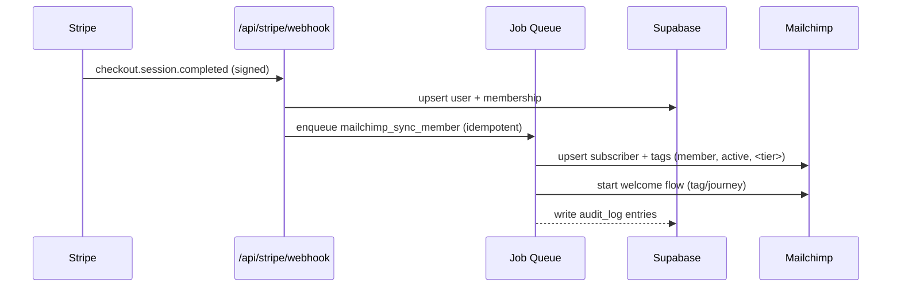
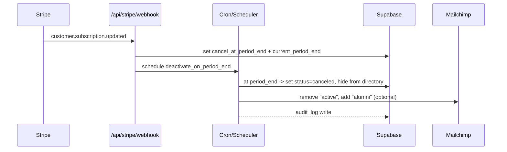
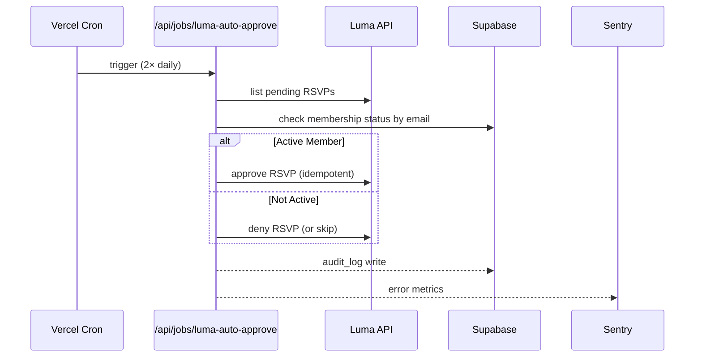

# REQUIREMENTS: Women Defining AI Community Platform MVP

**Source Document:** `WDAI Foundation_ Tech stack considerations.pdf`
**Last Updated:** November 2, 2025
**Status:** Approved for MVP Development
**Stakeholder:** Women Defining AI Foundation

---

## Table of Contents

1. [Background & Context](#background--context)
2. [Primary & Secondary Goals](#primary--secondary-goals)
3. [User Roles](#user-roles)
4. [Technology Stack](#technology-stack)
5. [Data Model](#data-model)
6. [Required Automations](#required-automations)
7. [Unified Agent Architecture](#unified-agent-architecture)
8. [DevOps & Maintainability](#devops--maintainability)
9. [High-Level Roadmap](#high-level-roadmap)
10. [Success Criteria](#success-criteria)

---

## 1. Background & Context

### Problem Statement

Women Defining AI has been using a "duct-taped" toolset that has evolved organically:
- **Wix** for website (extremely closed system)
- **Slack** for community (hard to automate)
- Multiple disconnected tools requiring manual intervention

This setup makes it:
- ❌ Hard to streamline operations
- ❌ Difficult to automate member lifecycle
- ❌ Impossible to provide unified agent access
- ❌ Challenging to scale as nonprofit grows

### Why Now?

The formation of a nonprofit entity requires:
- **New Stripe account** (new EIN) → Need to migrate payments anyway
- **Cancel all current Wix memberships** → Members must sign up again
- **Fresh start opportunity** → Time to build the right stack

This is the perfect moment to make one big strategic move rather than incremental patches.

---

## 2. Primary & Secondary Goals

### Primary Goal

**Get off Wix (extremely closed system)**
- Direct Stripe integration for subscriptions/donations
- Own the membership data
- Full control over user experience
- No vendor lock-in

### Secondary Goal

**Design stack such that operations can be automated/streamlined**
- Automated member lifecycle (signup → welcome → renewal → cancellation)
- Agent-ready unified API for intelligent automation
- Minimal manual intervention required
- Observable and debuggable workflows

---

## 3. User Roles

### Visitor
- **Access:** Public pages only
- **Capabilities:**
  - View marketing pages
  - Browse pricing
  - Purchase membership/donate
  - Sign up for account
- **Authentication:** None required

### Member
- **Access:** Authenticated member portal
- **Capabilities:**
  - Access member directory (with privacy controls)
  - View gated resources (videos, PDFs, links)
  - RSVP to events
  - Edit own profile
  - Set visibility preferences
- **Authentication:** Clerk (email/social login)

### Leader
- **Access:** Authenticated leader dashboard + all member access
- **Capabilities:**
  - All member capabilities
  - Create/manage community events via Luma
  - Upload/manage resources for members
  - Access leader-only content
- **Authentication:** Clerk (role: leader)

### Agent (System)
- **Access:** Scoped API endpoints via MCP
- **Capabilities:**
  - Read member data (with scoped permissions)
  - Perform Stripe operations (refunds, cancellations)
  - Manage events via Luma API
  - Access analytics data
  - Execute automations
- **Authentication:** Agent API keys with specific scopes

### Admin (Future)
- **Access:** Currently via GitHub/Supabase portal
- **Capabilities:**
  - Full database access
  - Manual interventions
  - Audit log review
  - System configuration
- **Authentication:** TBD (separate admin interface in future phase)

---

## 4. Technology Stack

### Frontend
- **Next.js 15 (App Router)** - React framework with Server Components
- **TypeScript** - Type safety and better DX
- **Vercel** - Hosting, CI/CD, and edge functions
- **Tailwind CSS** - Utility-first styling (implied)

### Authentication & Authorization
- **Clerk** - User authentication and session management
  - Supports roles: visitor, member, leader
  - Service accounts for agent access
  - Webhook integration for user lifecycle events

### Database & Storage
- **Supabase** - Backend-as-a-Service
  - **Postgres** - Relational database with JSONB support
  - **Row Level Security (RLS)** - Policy-based data access control
  - **Storage** - File uploads for resources
  - **Real-time** (optional) - Websocket subscriptions for future features

### Payments
- **Stripe** - Payment processing and subscription management
  - **Checkout** - Hosted checkout pages
  - **Customer Portal** - Self-service subscription management
  - **Webhooks** - Lifecycle event automation

### Video Content
- **Vimeo** - Video hosting with embeds
  - Gated video access (member-only)
  - **No Notion embeds** (per requirements)

### Event Management
- **Luma API** - Event creation and RSVP management
  - Programmatic event creation (via single backend route)
  - RSVP status checking
  - Auto-approval automation

### Email Marketing
- **Mailchimp** - Email campaigns and automation
  - **Audience management** - Member segmentation
  - **Tags** - Dynamic segmentation (member, active, tier)
  - **Automations** - Welcome series, re-engagement

### Job Orchestration & Scheduling

**Option 1 (Recommended):**
- **Inngest** - Durable job runner
  - Automatic retries with backoff
  - Job replay and debugging UI
  - Built-in observability
  - Ideal for complex workflows

**Option 2 (Alternative):**
- **Supabase Edge Functions + pgcron** - Postgres-native scheduling
  - Fewer dependencies
  - Tight integration with database
  - Good for simpler jobs

**Simple Scheduled Jobs:**
- **Vercel Cron** - Time-based triggers
  - 2× daily Luma auto-approval
  - 2× daily Slack status sync

### Observability
- **Sentry** - Error tracking and performance monitoring
  - Frontend errors
  - Backend API errors
  - Release tagging
- **Vercel Logs** - Request/response logging
- **Optional:** OpenTelemetry for distributed tracing

### Caching & Rate Limiting (Optional but Recommended)
- **Upstash Redis** - Serverless Redis
  - Webhook idempotency locks
  - Global rate limiting
  - Short-lived job queues

### API Specification
- **Zod** - Runtime validation
- **Zod → OpenAPI** - Contract-first API design
  - Generate OpenAPI 3.0 specs from Zod schemas
  - MCP tool manifest generation
  - Contract testing with MSW

### CI/CD & Testing
- **GitHub** - Source control and CI/CD
- **Vercel Preview Deploys** - PR-based staging environments
- **Jest/Vitest** - Unit testing
- **Playwright** - End-to-end testing
- **MSW (Mock Service Worker)** - API mocking for contract tests

---

## 5. Data Model

### Minimum Viable Schema

#### users
```typescript
interface User {
  id: string                    // Clerk user ID (UUID)
  email: string
  name: string
  role: 'visitor' | 'member' | 'leader'
  image_url?: string
  linkedin_url?: string
  visibility: boolean           // Show in member directory?
  stripe_customer_id?: string   // Stripe Customer ID
  slack_user_id?: string        // Slack User ID (for sync)
  mailchimp_id?: string         // Mailchimp Subscriber ID
  created_at: Date
  updated_at: Date
}
```

#### memberships
```typescript
interface Membership {
  id: string
  user_id: string               // FK to users.id
  tier: 'monthly' | 'annual' | 'donor_annual'
  status: 'active' | 'trialing' | 'past_due' | 'canceled'
  stripe_subscription_id: string
  current_period_end: Date      // When membership expires
  cancel_at_period_end: boolean // Scheduled cancellation?
  created_at: Date
  updated_at: Date
}
```

#### resources
```typescript
interface Resource {
  id: string
  title: string
  type: 'video' | 'pdf' | 'link'
  url: string
  vimeo_id?: string             // For gated Vimeo videos
  visibility: 'member' | 'leader'
  created_by: string            // FK to users.id
  created_at: Date
  updated_at: Date
}
```

#### events
```typescript
interface Event {
  id: string
  luma_event_id: string         // Luma's event ID
  title: string
  starts_at: Date
  region?: string
  category?: string
  created_by: string            // FK to users.id
  visibility: 'public' | 'member' | 'leader'
  created_at: Date
  updated_at: Date
}
```

#### audit_log
```typescript
interface AuditLog {
  id: string
  actor: string                 // user_id, 'agent:{name}', 'system:{job}'
  action: string                // 'member:created', 'event:approved', etc.
  target_type: string           // 'user', 'event', 'resource'
  target_id?: string            // ID of affected entity
  metadata: Record<string, any> // JSONB - additional context
  created_at: Date
}
```

#### agent_keys
```typescript
interface AgentKey {
  id: string
  name: string                  // e.g., 'Finance Agent'
  hashed_key: string            // bcrypt hash of API key
  scopes: string[]              // ['members:read', 'payments:write']
  created_at: Date
  last_used_at?: Date
  revoked: boolean              // Soft delete
}
```

#### integrations
```typescript
interface Integration {
  id: string
  user_id: string               // FK to users.id
  slack_user_id?: string
  slack_status?: 'active' | 'inactive' | 'deactivated'
  slack_synced_at?: Date
  mailchimp_subscriber_id?: string
  mailchimp_synced_at?: Date
  luma_profile_id?: string
  created_at: Date
  updated_at: Date
}
```

### Security: Row-Level Security (RLS)

**REQUIREMENT:** Enable Supabase RLS from day one on ALL tables.
- **No public write access** without service role
- **Clerk JWT claims** → Postgres policies
- **Service role** used ONLY on server-side

Example policy:
```sql
-- Members can read member-visible resources
CREATE POLICY "members_read_resources"
ON resources FOR SELECT
TO authenticated
USING (
  visibility = 'member'
  AND (auth.jwt() ->> 'role')::text IN ('member', 'leader')
);
```

---

## 6. Required Automations

### A. New Member → Mailchimp Add + Tag "active", Start Welcome Series

**Trigger:**
- `checkout.session.completed` (Stripe webhook)
- `customer.subscription.created` (Stripe webhook)
- `customer.subscription.updated` (Stripe webhook)

**Process Flow:**
1. `/api/stripe/webhook` receives event
2. Verifies signature (security requirement)
3. Upserts `users` table (create user if new)
4. Upserts `memberships` table (create/update subscription)
5. Enqueues job: `mailchimp_sync_member` (idempotent)

**Job: mailchimp_sync_member**
1. Upsert Mailchimp subscriber (email, name)
2. Apply tags: `member`, `active`, `<tier>` (monthly/annual/donor_annual)
3. Trigger Mailchimp welcome series (via automation ID or tag-based journey)

**Observability Requirements:**
- Sentry breadcrumb on webhook receipt
- Idempotency key = Stripe `event.id`
- Retries with exponential backoff (3 attempts)
- Dead Letter Queue (DLQ) for Mailchimp failures
- **Alert on >5 failures/hour**

---

### B. New Member → Welcome Onboarding Series

**Implementation:** Handled as part of Automation A above.
- Mailchimp journey starts automatically on tag application (`member`, `active`)
- Welcome series configured in Mailchimp dashboard

---

### C. Canceled Member → DB Updates with Last Day; Auto-Remove from Member Pages at Period End

**Trigger:**
- `customer.subscription.updated` (Stripe webhook)
  - When `cancel_at_period_end = true`
  - OR `status = canceled`

**Process Flow:**
1. Webhook updates `memberships.current_period_end`
2. Webhook sets `memberships.cancel_at_period_end = true`
3. Enqueue scheduled job: `deactivate_on_period_end`
   - Scheduled to run at `current_period_end` timestamp

**Job: deactivate_on_period_end**
1. On execution (at period end):
   - Set `memberships.status = 'canceled'`
   - Drop "active" tag in Mailchimp
   - Keep "alumni" tag (optional, if desired)
   - Set `users.visibility = false` (hide from member directory)
2. Write audit_log entry

**Observability Requirements:**
- Guard against clock drift (verify timestamp)
- Verify user not already reactivated before executing
- **Alert if membership not found or already inactive**

---

### D. Slack User Status Sync (invite/active/inactive/deactivated) → Reflect in Core DB

**Trigger:**
- Cron job: **Twice daily** → `/api/jobs/slack-sync`
- OR on-demand admin action (future)

**Process Flow:**
1. For each member with `visibility = true`:
   - Lookup Slack user by email via Slack API
   - Reconcile status to `integrations.slack_status`
   - Update `integrations.slack_synced_at`
2. If deactivated or inactive:
   - Mark in database
   - Optional: email nudge for inactive users (future)

**Observability Requirements:**
- Rate limit handling (Slack API tier limits)
- Partial failures logged & retried next sync
- **Alert on >10% lookup failures**
- Store `last_seen_at` timestamp

**Important Note:**
- Slack "invite" endpoints require **elevated scopes** (Admin API or SCIM on Enterprise Grid)
- **MVP:** Status sync ONLY (read-only)
- **Future:** Add invites if workspace allows Admin/SCIM access

---

### E. Luma Events → 2× Daily Auto-Approval Based on Membership

**Trigger:**
- Cron job: **Twice daily** → `/api/jobs/luma-auto-approve`

**Process Flow:**
1. Fetch pending Luma RSVPs or submissions via Luma API
2. For each RSVP:
   - Extract email from RSVP
   - Query `memberships` table to verify `active` status
   - If active: approve via Luma API
   - If not active: deny (or skip/ignore)
3. Write audit_log entries for each decision

**Observability Requirements:**
- **Alert on Luma API failures** (5xx errors)
- Idempotent approvals (check current RSVP status before API call)
- Log approval/denial counts per run

---

## 7. Unified Agent Architecture

### Requirement: Single Surface, MCP-Ready

**All agents** go through `/api/agents/*` with **scoped keys** (no user cookies).

Each key has **narrow scopes** stored in `agent_keys.scopes` array.

Clerk service users can be used for stronger auditing (optional).

### Agent API Endpoints

#### `/api/agents/members`
- **Methods:** GET, POST, PATCH, DELETE
- **Scopes:** `members:read`, `members:write`
- **Backend:** Supabase-backed CRUD
- **Use Cases:**
  - Read member directory
  - Update member profiles
  - Search members by criteria

#### `/api/agents/payments`
- **Methods:** GET, POST
- **Scopes:** `payments:read`, `payments:write`
- **Backend:** Stripe API operations
- **Use Cases:**
  - Read refund history
  - Issue refunds
  - Cancel subscriptions
  - View subscription metrics

#### `/api/agents/events`
- **Methods:** GET, POST
- **Scopes:** `events:read`, `events:write`
- **Backend:** Luma API + Supabase
- **Use Cases:**
  - Read upcoming events
  - Create events (via leader flow)
  - RSVP approvals (read-only in MVP except create via leader flow)

#### `/api/agents/content`
- **Methods:** GET, POST, PATCH, DELETE
- **Scopes:** `content:read`, `content:write`
- **Backend:** Supabase resources table
- **Use Cases:**
  - Read available resources
  - Upload new resources
  - Update resource metadata
  - (Future) Notion read-only for editorial notes (no embeds)

#### `/api/agents/analytics`
- **Methods:** GET
- **Scopes:** `analytics:read`
- **Backend:** Aggregated data from Supabase + integrations
- **Use Cases:**
  - Engagement metrics (emails opened, events attended)
  - Resource view counts
  - Membership growth trends

### MCP Exposure

**Requirement:** Publish an **OpenAPI spec** that lists these endpoints + scopes.

Agents load the spec via **MCP tool manifest**.

**Implementation:**
1. Define Zod schemas for all request/response types
2. Use `@asteasolutions/zod-to-openapi` to generate OpenAPI 3.0 spec
3. Serve spec at `/api/agents/openapi.json`
4. Provide MCP tool manifest referencing the OpenAPI spec

### Guardrails

1. **Per-scope rate limits:**
   - Read operations: 100 requests/minute
   - Write operations: 10 requests/minute
2. **Per-endpoint idempotency:**
   - POST/PATCH operations use idempotency keys
   - Stored in Redis or database
3. **Audit every write:**
   - Actor = `agent:{name}`
   - Logged to `audit_log` table
   - Includes timestamp, action, target, metadata

---

## 8. DevOps & Maintainability

### Core DevOps Stack

#### Observability
- **Sentry** (Frontend + API):
  - Release tagging (correlate errors with deployments)
  - Source maps uploaded (readable stack traces)
  - Alert rules (error rate thresholds)
- **Vercel Logs**:
  - Request/response logging
  - Optional: Logtail/Better Stack for longer retention (7+ days)
- **Basic health checks:**
  - `/api/health` endpoint
  - Checks: DB connection, Stripe API, Supabase reachability

#### Job Dashboards
- **Inngest UI** (if using Inngest):
  - Job execution history
  - Retry attempts
  - Failure reasons
- **OR custom admin table + page:**
  - Query `audit_log` for job executions
  - Filter by actor = `system:{job_name}`

#### Backgrounds & Scheduling
- **Vercel Cron** for "2× daily" and nightly jobs:
  - Luma auto-approval
  - Slack status sync
- **Durable job runner** (pick ONE):
  - **Inngest** (recommended):
    - Robust retry logic
    - Job replay capability
    - Built-in UI for debugging
  - **Supabase Edge Functions + pgcron**:
    - Fewer dependencies
    - Postgres-native schedules
    - Good for simpler workflows

#### Queues / Idempotency / Rate Limits
- **Upstash Redis** (lightweight, serverless):
  - Webhook idempotency locks (prevent double-processing)
  - Global rate limits (agent API)
  - Short job queues (optional)

#### Secrets Management
- **Vercel environment variables:**
  - Per-environment (dev, staging, prod)
  - Never commit secrets to Git
- **Rotation policy:** Quarterly
- **Principle of least privilege:** Each service gets only required scopes

#### CI/CD
- **GitHub + Vercel:**
  - Preview Deploys for every PR
  - Auto-deploy to production on merge to `main`
- **GitHub Actions:**
  - Type check (`npm run type-check`)
  - Lint (`npm run lint`)
  - Unit tests (`npm run test`)
  - Build verification (`npm run build`)
  - **Database migration check** (ensure migrations are up-to-date)

#### Schema & Migrations
- **Drizzle** OR **Prisma** for typed schema:
  - Type-safe database access
  - Automatic TypeScript types generation
  - Migration files versioned in Git
- **Migrations run in CI before deploy:**
  - Ensure database schema is always compatible with code
- **Supabase SQL policies (RLS) under version control:**
  - RLS policies defined in migration files
  - Applied automatically on deploy

#### Testing
- **Unit tests** (Jest/Vitest):
  - Utility functions
  - Business logic
  - Zod schemas
- **Integration tests** (Supertest + local Postgres):
  - API routes with mocked external services
  - Database operations
- **E2E tests** (Playwright):
  - Critical user flows (signup, payment, content access)
- **Contract tests:**
  - Stripe/Luma/Mailchimp using OpenAPI mocks (MSW)
  - Stripe test mode fixtures
- **Webhook signature tests:**
  - Invalid signature MUST fail with 400
  - Valid signature MUST process event

#### SLOs & Alerts (Example Baselines)
- **Checkout success rate** ≥ 98% over 7 days
- **Webhook processing lag** p95 < 2 minutes
- **Leader event creation success** ≥ 99% over 7 days
- **Cron job success** ≥ 99% last 24 hours (no consecutive failures)
- **API error rate** p95 < 1% (5xx errors)

**Alert routing:** Email + Slack `#eng-alerts` channel

#### Backups & Recovery
- **Supabase daily backups:**
  - Automatic (7-day retention on free tier, 30+ days on paid)
- **Quarterly restore rehearsal:**
  - Test restore to staging environment
  - Verify data integrity
- **One-click rollback:**
  - Via Vercel deployments (keep last 10 deployments)

#### Runbooks (in repo `/docs/runbooks`)
1. **Webhook failures** (Stripe/Mailchimp/Luma)
   - Symptoms, diagnosis, recovery steps
2. **Job backlog growing**
   - How to identify stuck jobs, manual replay
3. **Slack API quota errors**
   - Rate limit handling, backoff strategy
4. **Hotfix flow**
   - How to deploy emergency fixes bypassing CI

---

## 9. Updated System Architecture (includes jobs & agents)

### High-Level System Diagram

```
Visitors ──► Next.js (Vercel) ──► Clerk (Auth)
                |
                |── Members UI (gated) ──► Supabase (DB + RLS)
                |                              ▲
                |                              |
                |── Vimeo embeds (members only)
                |

Leaders UI ──► /api/luma/createEvent ──► Luma API
                |
                |
Stripe Checkout/Portal ◄──┼──► /api/stripe/webhook ──► Jobs(Queue) ──► Mailchimp
                |                              |              ▲
                |                              └──────────────┘
                |

Cron (Vercel) ──► /api/jobs/*  (slack-sync, luma-auto-approve, deactivate-on-period-end)
                |

Agents (MCP) ──► /api/agents/{members|payments|events|content|analytics}
                |

Observability: Sentry (FE/BE), Vercel Logs; optional Upstash (rate-limit/idempotency)
```

### System Components Explained

#### User-Facing Layer
- **Visitors** → Public Next.js pages (marketing, pricing)
- **Members UI** → Gated portal (directory, resources, events) - requires Clerk authentication
- **Leaders UI** → Extended portal with event/resource creation capabilities
- **Stripe Checkout/Portal** → Hosted payment pages for subscriptions

#### Authentication & Authorization
- **Clerk** → User authentication with role-based access (visitor/member/leader)
- **Supabase RLS** → Database-level authorization via Postgres policies
- **JWT Claims** → Clerk JWT contains role, passed to Supabase for RLS evaluation

#### Data Layer
- **Supabase (DB + RLS)** → PostgreSQL database with Row-Level Security
  - All user data, memberships, resources, events
  - RLS policies enforce role-based access
  - Clerk JWT claims drive policy evaluation

#### Content Delivery
- **Vimeo embeds** → Gated video content for members only
- **Supabase Storage** → PDF uploads, resource files

#### Payment Integration
- **Stripe Checkout** → Hosted checkout for new subscriptions
- **Stripe Customer Portal** → Self-service subscription management
- **Stripe Webhook** → `/api/stripe/webhook` receives lifecycle events
  - Verifies signature (security)
  - Upserts users + memberships
  - Enqueues Mailchimp sync job

#### Job Processing
- **Jobs (Queue)** → Durable job runner (Inngest recommended)
  - `mailchimp_sync_member` → Add member to Mailchimp with tags
  - `deactivate_on_period_end` → Scheduled member deactivation
  - Retry logic with exponential backoff
  - Dead Letter Queue (DLQ) for failures

#### Email Marketing
- **Mailchimp** → Audience management and automations
  - Tag-based segmentation (member, active, tier)
  - Welcome series automation
  - Alumni tag on cancellation

#### Event Management
- **Luma API** → Event creation and RSVP management
  - Leaders create events via `/api/luma/createEvent`
  - Cron job approves RSVPs 2× daily

#### Scheduled Jobs
- **Cron (Vercel)** → Time-based job triggers
  - `/api/jobs/slack-sync` → 2× daily Slack status reconciliation
  - `/api/jobs/luma-auto-approve` → 2× daily RSVP auto-approval
  - `/api/jobs/deactivate-on-period-end` → Scheduled member deactivation

#### Agent API (MCP)
- **Agents (MCP)** → Unified API for intelligent automation
  - `/api/agents/members` → Member CRUD operations
  - `/api/agents/payments` → Stripe operations (refunds, cancellations)
  - `/api/agents/events` → Luma event management
  - `/api/agents/content` → Resource management
  - `/api/agents/analytics` → Engagement metrics
  - Scoped API keys with narrow permissions
  - Rate limiting per scope
  - All writes logged to audit_log

#### Observability
- **Sentry (FE/BE)** → Error tracking and performance monitoring
- **Vercel Logs** → Request/response logging
- **Upstash (optional)** → Redis for:
  - Rate limiting (agent API)
  - Idempotency locks (webhook deduplication)
  - Short-lived job queues

### Data Flow: New Member Signup

```
1. Visitor clicks "Join" → Stripe Checkout
2. Visitor completes payment → Stripe creates subscription
3. Stripe sends webhook → /api/stripe/webhook
4. Webhook verifies signature → upserts user + membership in Supabase
5. Webhook enqueues job → mailchimp_sync_member
6. Job adds member to Mailchimp → tags: member, active, <tier>
7. Job triggers welcome series → Mailchimp automation
8. Member can now log in via Clerk → access gated portal
9. Supabase RLS verifies role from Clerk JWT → grants access
```

### Data Flow: Member Cancellation

```
1. Member cancels subscription → Stripe Customer Portal
2. Stripe sends webhook → /api/stripe/webhook (customer.subscription.updated)
3. Webhook updates membership → cancel_at_period_end = true
4. Webhook schedules job → deactivate_on_period_end (runs at period_end)
5. Member retains access until period_end
6. At period_end, job executes:
   - Sets membership status = canceled
   - Sets user visibility = false (hide from directory)
   - Updates Mailchimp → removes "active" tag, adds "alumni"
7. Member loses access to gated content
```

### Security Boundaries

1. **Authentication Boundary** (Clerk)
   - Verifies user identity
   - Issues JWT with role claims
   - Manages sessions

2. **Authorization Boundary** (Supabase RLS)
   - Enforces data access policies
   - Role-based query filtering
   - Prevents unauthorized reads/writes

3. **Webhook Boundary** (/api/stripe/webhook)
   - Signature verification (Stripe secret)
   - Idempotency checks (prevent double-processing)
   - Rate limiting

4. **Agent Boundary** (/api/agents/*)
   - API key authentication
   - Scope-based authorization
   - Rate limiting per scope
   - Audit logging

---

## 10. Sequence Diagrams (Key Flows)

### Stripe → Member Activation → Mailchimp



**Flow Description:**
1. User completes Stripe Checkout
2. Stripe sends signed webhook to `/api/stripe/webhook`
3. Webhook verifies signature and upserts user + membership in Supabase
4. Webhook enqueues idempotent job `mailchimp_sync_member`
5. Job adds member to Mailchimp with tags: `member`, `active`, `<tier>`
6. Job triggers welcome series automation
7. Job writes audit log entries for observability

---

### Cancel at Period End → Deactivate



**Flow Description:**
1. User cancels subscription via Stripe Customer Portal
2. Stripe sends `customer.subscription.updated` webhook
3. Webhook updates database: `cancel_at_period_end = true`, stores `current_period_end`
4. Webhook schedules job `deactivate_on_period_end` to run at period end timestamp
5. At period end, job sets membership status to `canceled`
6. Job hides member from directory (`visibility = false`)
7. Job updates Mailchimp tags (remove "active", optionally add "alumni")
8. Job writes audit log entry

**Important:** Member retains full access until `current_period_end` date.

---

### Luma Auto-Approval (2× Daily)



**Flow Description:**
1. Vercel Cron triggers job 2× daily (9am, 9pm UTC recommended)
2. Job fetches pending Luma RSVPs via Luma API
3. For each RSVP, extract email address
4. Query Supabase memberships table for active subscription by email
5. If active: approve RSVP via Luma API (idempotent operation)
6. If not active: deny RSVP or skip (configurable)
7. Write audit log entry for each decision
8. Send error metrics to Sentry if Luma API fails

**Observability:** Alert on Luma API failures; log approval/denial counts per run.

---

## 10. High-Level Roadmap (2 Developers)

### Phase 1 — Foundations (Week 1-2)

**Deliverables:**
- Running app with authentication
- Stripe purchase creates user/membership in DB

**Tasks:**
- Next.js scaffold with App Router
- Clerk auth integration (roles: visitor, member, leader)
- Supabase schema + RLS policies
- Stripe Checkout + Customer Portal
- `/api/stripe/webhook` with signature verification + idempotency
- Public pages (static homepage, pricing)
- DevOps: Sentry setup, Vercel envs, CI (lint/type/tests)
- **Decision:** Pick Inngest OR Supabase Edge + pgcron
- Tests: Unit tests for auth & webhooks; OpenAPI skeleton

---

### Phase 2 — Member Portal (Week 3-4)

**Deliverables:**
- Members can log in and see content
- New member welcome series runs automatically

**Tasks:**
- Member profile edit + directory (with visibility toggle)
- Vimeo embed pages (courses/recordings) - gated routes
- Stripe → Mailchimp automation:
  - Job: `mailchimp_sync_member` (upsert + tag + start welcome)
- DevOps: Alert rules for webhook failures; job dashboard

---

### Phase 3 — Leader Portal + Luma (Week 5-6)

**Deliverables:**
- Leaders can create events via simple form
- Luma auto-approval runs 2× daily

**Tasks:**
- Leader dashboard (role-gated)
- Single form → `/api/luma/createEvent`
- Resource admin (CRUD in Supabase) for leaders
- Luma 2× daily auto-approval job
- Tests: Integration tests for Luma create/approve; E2E for leader flow

---

### Phase 4 — Cancellation & Slack Sync (Week 7-8)

**Deliverables:**
- Members auto-removed on last day
- Slack statuses reflected in DB

**Tasks:**
- Cancel at period end:
  - Schedule job: `deactivate_on_period_end`
  - Execute at `current_period_end`
  - Update Mailchimp tags (remove "active", add "alumni")
- Slack sync job:
  - Status reconciliation (no invites in MVP)
  - 2× daily via Cron
- Observability:
  - SLO dashboards (Sentry + Vercel)
  - Error budget alerts
  - Audit log views (admin interface)

---

### Phase 5 — Unified Agent API + MCP (Week 9-10)

**Deliverables:**
- Agents functional via MCP
- All agent access audited

**Tasks:**
- `/api/agents/{members|payments|events|content|analytics}` with scoped keys
- OpenAPI spec generation from Zod schemas
- MCP tool manifest
- Contract tests for agent endpoints
- First agents:
  - **Finance Agent:** Stripe reporting (revenue, refunds)
  - **Support Agent:** Refund/cancel operations
  - **Engagement Agent:** Mailchimp suggestions (draft campaigns)

---

### Phase 6 — Hardening & Launch (Week 11)

**Deliverables:**
- Production-ready deployment
- All automations verified
- Monitoring active

**Tasks:**
- Load test critical paths (checkout, event creation)
- Polish UX (design review, accessibility audit)
- Content migration from Wix
- Backup/restore rehearsal (staging → production)
- Runbook sign-off (team walkthrough)
- Incident drill (simulate webhook failure, job backlog)
- **Go-live in Vercel Production**

---

## 10. Success Criteria

### Phase 1 (Foundations)
- [ ] User can sign up via Clerk
- [ ] User can purchase monthly subscription via Stripe Checkout
- [ ] Purchase creates `users` + `memberships` records in Supabase
- [ ] Webhook signature verification passes (test with Stripe CLI)
- [ ] CI pipeline runs on every PR (lint, type-check, test, build)

### Phase 2 (Member Portal)
- [ ] Member can log in and see member directory
- [ ] Member can toggle visibility in directory
- [ ] Member can view gated Vimeo video
- [ ] New member receives welcome email within 2 minutes
- [ ] Mailchimp tags match membership tier and status

### Phase 3 (Leader Portal)
- [ ] Leader can create Luma event via single form
- [ ] Event appears in Luma within 30 seconds
- [ ] Leader can upload PDF resource
- [ ] Luma auto-approval job runs 2× daily (9am, 9pm UTC)
- [ ] Active members auto-approved for RSVPs

### Phase 4 (Cancellation & Slack)
- [ ] Canceled member retains access until `current_period_end`
- [ ] Member auto-removed from directory on period end date
- [ ] Mailchimp tags updated (remove "active", add "alumni")
- [ ] Slack status sync runs 2× daily (10am, 10pm UTC)
- [ ] Slack status reflected in `integrations.slack_status`

### Phase 5 (Agent API)
- [ ] Agent can authenticate with scoped API key
- [ ] Agent can read member list via `/api/agents/members`
- [ ] Agent write operations logged to `audit_log`
- [ ] OpenAPI spec served at `/api/agents/openapi.json`
- [ ] Rate limits enforced (100 read/min, 10 write/min)

### Phase 6 (Launch)
- [ ] All SLOs green for 48 hours
- [ ] Backup restore tested successfully
- [ ] Runbooks reviewed by team
- [ ] Content migrated from Wix
- [ ] Production domain configured (custom domain)
- [ ] Monitoring alerts active (Sentry + Slack)

---

## 11. Maintainability Review (Risks & Choices)

### Identified Risks & Mitigation Strategies

#### 1. Webhooks & Jobs are the Blast Radius

**Risk:** Webhook failures or job failures can cascade and affect multiple systems.

**Mitigation:**
- **Idempotency keys** - Prevent duplicate processing (use Stripe event.id)
- **Retries with backoff** - Automatic retry with exponential backoff (3 attempts)
- **Dead Letter Queue (DLQ)** - Failed jobs go to DLQ for manual review
- **Dashboards** - Job execution monitoring (Inngest UI or custom admin panel)
- **Alerts** - Slack/email alerts on >5 failures/hour

---

#### 2. Too Many Moving Parts

**Risk:** Multiple integrations (Stripe, Mailchimp, Luma, Slack) create complexity.

**Mitigation:**
- **Choose ONE durable job system:**
  - **Inngest** (recommended): Best DX + visibility, built-in retries, job replay UI
  - **Supabase Edge + pgcron**: Fewer dependencies, Postgres-native, good for simple workflows
- **Decision:** Use Inngest for MVP (can migrate later if needed)

---

#### 3. Slack Invites Can Be Tricky

**Risk:** Slack invite endpoints require elevated permissions (Admin API or SCIM on Enterprise Grid).

**Mitigation:**
- **Build sync as status-only FIRST** (read-only, no invites)
- **Add invites later** if workspace allows Admin/SCIM access
- **MVP Scope:** Status reconciliation only (active/inactive/deactivated)

---

#### 4. Notion Integration (Explicitly Out of Scope)

**Requirement:** Notion embeds are **banned** from MVP UI (per stakeholder request).

**Future Consideration:**
- If needed for **Knowledge/Content agent**, add read-only endpoints behind `/api/agents/content`
- Use Notion as backend data source for agents, but never embed in user-facing UI

---

#### 5. Row-Level Security (RLS) Investment

**Requirement:** Enable RLS from day one on ALL Supabase tables.

**Rationale:**
- **Prevents whole-class bugs** (data leaks, unauthorized access)
- **Defense in depth** (even if application logic fails, database enforces access control)
- **Easier to add early** than retrofit later

**Action:** Invest time upfront in RLS policy design and testing.

---

#### 6. Schema Evolution Strategy

**Requirement:** Version migrations; **never hot-edit via Supabase console**.

**Best Practices:**
- Use Drizzle or Prisma for typed schema
- All migrations in version-controlled files
- Migrations run in CI before deploy
- RLS policies defined in migration files (not console)

**Rationale:** Prevents production schema drift and enables rollback.

---

#### 7. Single API Surface for Agents

**Requirement:** All agent access via `/api/agents/*` with scoped keys.

**Benefits:**
- **Reduces maintenance** - One auth model, one audit log system
- **Simplifies security** - Single surface to secure and monitor
- **Enables observability** - All agent actions logged consistently

**Requirements:**
- **Enforce strict scopes** - Each key has narrow permissions array
- **Rate limits** - Per-scope rate limiting (100 read/min, 10 write/min)
- **Audit everything** - All writes logged to audit_log table

---

## Appendix: Key Decisions to Finalize

### A. Job Orchestration Choice

**Decision Required:** Inngest vs Supabase Edge Functions + pgcron

**Factors to Consider:**
- **Inngest Pros:** Better DX, built-in UI, automatic retries, job replay
- **Inngest Cons:** Additional vendor dependency, pricing at scale
- **Supabase Edge Pros:** Fewer dependencies, Postgres-native, tighter DB integration
- **Supabase Edge Cons:** More manual retry logic, less observability out-of-box

**Recommendation:** **Inngest** for MVP (can migrate to Edge Functions later if needed)

---

### B. Slack Integration Scope

**Decision Required:** Status sync only vs. status + invites

**Factors to Consider:**
- Slack invite endpoints require **Admin API** or **SCIM** (Enterprise Grid only)
- Most Slack workspaces on Standard plan don't have invite API access

**Recommendation:** **Status sync ONLY** in MVP. Add invites in Phase 7+ if Admin API available.

---

### C. Admin Dashboard Timing

**Decision Required:** Build in Phase 6 vs. defer to Phase 7+

**Factors to Consider:**
- Admins can use Supabase dashboard directly for MVP
- GitHub + Vercel for deployments
- Custom admin UI takes 1-2 weeks

**Recommendation:** **Defer to Phase 7+**. Use Supabase portal + GitHub for MVP operations.

---

## Document Metadata

**Source Document:** `WDAI Foundation_ Tech stack considerations.pdf`
**Extracted:** November 2, 2025
**Version:** 1.0
**Status:** Approved for Development
**Next Review:** After Phase 1 completion (Week 2)
**Stakeholder Approval:** Pending

---

**This document is the single source of truth for WDAI Community Platform MVP requirements.**
All implementation must align with these specifications.
