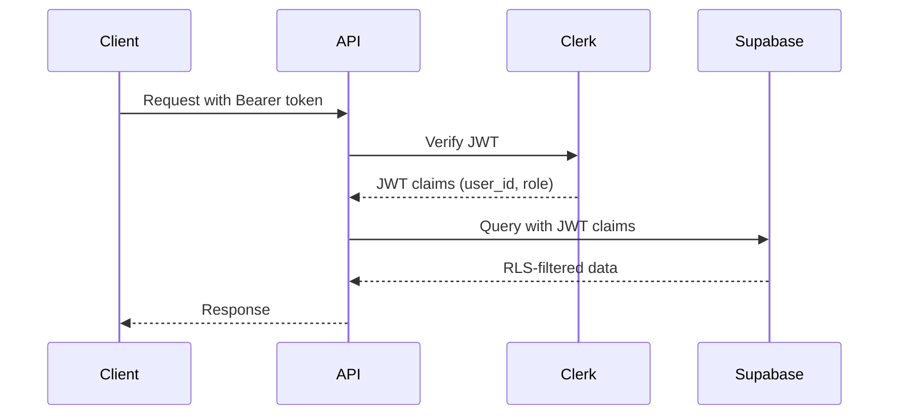

# API ARCHITECTURE - Women Defining AI Community Platform

**Version:** 1.0
**Last Updated:** November 2, 2025
**Framework:** Next.js 15 App Router

## Table of Contents

1. [API Overview](#api-overview)
2. [Route Structure](#route-structure)
3. [Webhook Endpoints](#webhook-endpoints)
4. [Cron Job Endpoints](#cron-job-endpoints)
5. [Agent API (MCP)](#agent-api-mcp)
6. [Authentication & Authorization](#authentication--authorization)
7. [Error Handling](#error-handling)
8. [Rate Limiting](#rate-limiting)
9. [OpenAPI Specification](#openapi-specification)

---

## API Overview

### Design Principles

1. **RESTful Design** - Standard HTTP methods and status codes
2. **Type-Safe** - Zod schemas for validation
3. **Idempotent** - Safe to retry operations
4. **Auditable** - Every write logged
5. **Secure** - Authentication required, RLS enforced
6. **Observable** - Structured logging, tracing
7. **Cacheable** - ETags, conditional requests

### API Architecture Diagram

```mermaid
graph TB
    subgraph "External Services"
        STRIPE[Stripe]
        CLERK[Clerk]
        MAILCHIMP[Mailchimp]
        LUMA[Luma]
        SLACK[Slack]
    end

    subgraph "API Gateway Layer"
        MW[Middleware<br/>Auth/Rate Limit]
        WEBHOOK[Webhook Handler<br/>Signature Verify]
    end

    subgraph "API Routes"
        direction LR
        WH[/api/stripe/webhook]
        CRON[/api/jobs/*]
        AGENT[/api/agents/*]
        APP[/api/app/*]
    end

    subgraph "Service Layer"
        US[UserService]
        MS[MembershipService]
        RS[ResourceService]
        ES[EventService]
        AS[AuditService]
    end

    subgraph "Data Layer"
        DB[(Supabase<br/>PostgreSQL)]
        REDIS[(Redis<br/>Cache)]
        STORAGE[(Supabase<br/>Storage)]
    end

    STRIPE --> WEBHOOK
    CLERK --> MW
    WEBHOOK --> WH
    MW --> AGENT
    MW --> APP

    WH --> MS
    CRON --> ES
    CRON --> US
    AGENT --> US
    AGENT --> MS
    APP --> RS

    US --> DB
    MS --> DB
    RS --> DB
    ES --> DB
    AS --> DB

    MS --> MAILCHIMP
    ES --> LUMA
    US --> SLACK

    MW --> REDIS
    WEBHOOK --> REDIS
```

---

## Route Structure

### Directory Organization

```
src/app/api/
├── stripe/
│   └── webhook/
│       └── route.ts              # Stripe webhook handler
├── clerk/
│   └── webhook/
│       └── route.ts              # Clerk webhook handler (optional)
├── jobs/
│   ├── luma-auto-approve/
│   │   └── route.ts              # Luma RSVP auto-approval
│   ├── slack-sync/
│   │   └── route.ts              # Slack status sync
│   └── cleanup/
│       └── route.ts              # Database cleanup jobs
├── agents/
│   ├── openapi.json/
│   │   └── route.ts              # OpenAPI spec endpoint
│   ├── members/
│   │   └── route.ts              # Member CRUD
│   ├── payments/
│   │   └── route.ts              # Payment operations
│   ├── events/
│   │   └── route.ts              # Event management
│   ├── content/
│   │   └── route.ts              # Resource management
│   └── analytics/
│       └── route.ts              # Analytics queries
├── app/
│   ├── auth/
│   │   ├── session/
│   │   │   └── route.ts          # Session management
│   │   └── refresh/
│   │       └── route.ts          # Token refresh
│   ├── members/
│   │   ├── route.ts              # Member operations
│   │   └── [id]/
│   │       └── route.ts          # Individual member
│   ├── resources/
│   │   ├── route.ts              # Resource operations
│   │   └── [id]/
│   │       └── route.ts          # Individual resource
│   ├── events/
│   │   ├── route.ts              # Event operations
│   │   └── [id]/
│   │       ├── route.ts          # Individual event
│   │       └── rsvp/
│   │           └── route.ts      # RSVP management
│   └── health/
│       └── route.ts              # Health check endpoint
└── middleware.ts                 # Global API middleware
```

---

## Webhook Endpoints

### /api/stripe/webhook

**Purpose:** Handle Stripe lifecycle events

```typescript
// route.ts
import { stripe } from '@/lib/stripe'
import { supabase } from '@/lib/supabase'
import { z } from 'zod'

const EventSchema = z.object({
  id: z.string(),
  type: z.string(),
  data: z.object({
    object: z.record(z.any())
  })
})

export async function POST(req: Request) {
  const body = await req.text()
  const sig = req.headers.get('stripe-signature')

  if (!sig) {
    return Response.json({ error: 'Missing signature' }, { status: 400 })
  }

  // 1. Verify signature
  let event
  try {
    event = stripe.webhooks.constructEvent(
      body,
      sig,
      process.env.STRIPE_WEBHOOK_SECRET!
    )
  } catch (err) {
    console.error('Webhook signature verification failed:', err)
    return Response.json({ error: 'Invalid signature' }, { status: 400 })
  }

  // 2. Check idempotency
  const { data: existing } = await supabase
    .from('job_idempotency')
    .select('id')
    .eq('job_type', 'stripe_webhook')
    .eq('idempotency_key', event.id)
    .single()

  if (existing) {
    return Response.json({ message: 'Already processed' }, { status: 200 })
  }

  // 3. Process event
  try {
    await processStripeEvent(event)

    // 4. Mark as processed
    await supabase.from('job_idempotency').insert({
      job_type: 'stripe_webhook',
      idempotency_key: event.id,
      status: 'completed',
      result: { event_type: event.type }
    })

    return Response.json({ received: true }, { status: 200 })
  } catch (error) {
    // Log error but return 200 to prevent retries
    await logError(error, event)
    return Response.json({ error: 'Processing failed' }, { status: 200 })
  }
}

async function processStripeEvent(event: Stripe.Event) {
  switch (event.type) {
    case 'checkout.session.completed':
      await handleCheckoutCompleted(event.data.object)
      break

    case 'customer.subscription.created':
    case 'customer.subscription.updated':
      await handleSubscriptionChange(event.data.object)
      break

    case 'customer.subscription.deleted':
      await handleSubscriptionCanceled(event.data.object)
      break

    case 'invoice.payment_failed':
      await handlePaymentFailed(event.data.object)
      break

    default:
      console.log(`Unhandled event type: ${event.type}`)
  }
}
```

**Events Handled:**
- `checkout.session.completed` - New member signup
- `customer.subscription.created` - Subscription created
- `customer.subscription.updated` - Tier change, renewal
- `customer.subscription.deleted` - Cancellation
- `invoice.payment_failed` - Payment failure

**Security:**
- Signature verification using `stripe-signature` header
- Idempotency using event ID
- Always returns 200 to prevent retries

---

## Cron Job Endpoints

### /api/jobs/luma-auto-approve

**Purpose:** Auto-approve Luma RSVPs for active members

```typescript
// route.ts
import { verifySecretKey } from '@/lib/auth'
import { lumaClient } from '@/lib/luma'
import { supabase } from '@/lib/supabase'
import { auditLog } from '@/lib/audit'

export async function GET(req: Request) {
  // Verify cron secret
  const authHeader = req.headers.get('authorization')
  if (authHeader !== `Bearer ${process.env.CRON_SECRET}`) {
    return Response.json({ error: 'Unauthorized' }, { status: 401 })
  }

  const startTime = Date.now()
  const results = {
    processed: 0,
    approved: 0,
    denied: 0,
    errors: []
  }

  try {
    // 1. Fetch pending RSVPs from Luma
    const pendingRSVPs = await lumaClient.getRSVPs({
      status: 'pending',
      limit: 100
    })

    for (const rsvp of pendingRSVPs) {
      results.processed++

      try {
        // 2. Check if email has active membership
        const { data: membership } = await supabase
          .from('memberships')
          .select('*, users!inner(*)')
          .eq('users.email', rsvp.email)
          .eq('status', 'active')
          .single()

        if (membership) {
          // 3. Approve RSVP
          await lumaClient.approveRSVP(rsvp.id)
          results.approved++

          // 4. Audit log
          await auditLog({
            actor: 'system:luma_auto_approve',
            action: 'rsvp:approved',
            target_type: 'event',
            target_id: rsvp.event_id,
            metadata: {
              rsvp_id: rsvp.id,
              user_email: rsvp.email,
              membership_tier: membership.tier
            }
          })
        } else {
          // Optionally deny non-members
          // await lumaClient.denyRSVP(rsvp.id)
          results.denied++
        }
      } catch (error) {
        results.errors.push({
          rsvp_id: rsvp.id,
          error: error.message
        })
      }
    }

    const duration = Date.now() - startTime

    // Log job execution
    await auditLog({
      actor: 'system:luma_auto_approve',
      action: 'job:completed',
      metadata: {
        ...results,
        duration_ms: duration
      }
    })

    return Response.json({
      success: true,
      ...results,
      duration_ms: duration
    })
  } catch (error) {
    await auditLog({
      actor: 'system:luma_auto_approve',
      action: 'job:failed',
      metadata: {
        error: error.message,
        results
      }
    })

    return Response.json({
      error: 'Job failed',
      details: error.message
    }, { status: 500 })
  }
}
```

**Schedule:** `0 9,21 * * *` (9am and 9pm UTC daily)

### /api/jobs/slack-sync

**Purpose:** Sync Slack user statuses to database

```typescript
// route.ts
import { slackClient } from '@/lib/slack'
import { supabase } from '@/lib/supabase'

export async function GET(req: Request) {
  // Verify cron secret
  const authHeader = req.headers.get('authorization')
  if (authHeader !== `Bearer ${process.env.CRON_SECRET}`) {
    return Response.json({ error: 'Unauthorized' }, { status: 401 })
  }

  const results = {
    checked: 0,
    active: 0,
    inactive: 0,
    deactivated: 0,
    errors: []
  }

  try {
    // 1. Get all visible members
    const { data: users } = await supabase
      .from('users')
      .select('id, email, slack_user_id')
      .eq('visibility', true)
      .in('role', ['member', 'leader'])

    for (const user of users) {
      results.checked++

      try {
        // 2. Lookup Slack user by email
        const slackUser = await slackClient.users.lookupByEmail({
          email: user.email
        })

        if (slackUser) {
          // 3. Update integration record
          const status = slackUser.deleted ? 'deactivated' :
                        slackUser.is_restricted ? 'inactive' : 'active'

          await supabase.from('integrations').upsert({
            user_id: user.id,
            slack_user_id: slackUser.id,
            slack_status: status,
            slack_synced_at: new Date().toISOString()
          }, {
            onConflict: 'user_id'
          })

          results[status]++
        }
      } catch (error) {
        if (error.data?.error !== 'users_not_found') {
          results.errors.push({
            user_id: user.id,
            error: error.message
          })
        }
      }
    }

    return Response.json({
      success: true,
      ...results
    })
  } catch (error) {
    return Response.json({
      error: 'Sync failed',
      details: error.message
    }, { status: 500 })
  }
}
```

**Schedule:** `0 10,22 * * *` (10am and 10pm UTC daily)

---

## Agent API (MCP)

### Design Principles

1. **Scoped Access** - Each key has specific permissions
2. **Rate Limited** - Per-scope limits enforced
3. **Audited** - Every operation logged
4. **OpenAPI First** - Schema-driven development

### /api/agents/members

**Purpose:** Member CRUD operations for agents

```typescript
// route.ts
import { z } from 'zod'
import { verifyAgentKey } from '@/lib/agents'
import { supabase } from '@/lib/supabase'
import { auditLog } from '@/lib/audit'
import { rateLimit } from '@/lib/rate-limit'

const MemberSchema = z.object({
  email: z.string().email(),
  name: z.string(),
  role: z.enum(['visitor', 'member', 'leader']),
  visibility: z.boolean().optional()
})

const QuerySchema = z.object({
  limit: z.number().min(1).max(100).default(20),
  offset: z.number().min(0).default(0),
  role: z.enum(['visitor', 'member', 'leader']).optional(),
  visibility: z.boolean().optional()
})

export async function GET(req: Request) {
  // 1. Verify agent key and scopes
  const agent = await verifyAgentKey(req)
  if (!agent) {
    return Response.json({ error: 'Unauthorized' }, { status: 401 })
  }

  if (!agent.scopes.includes('members:read')) {
    return Response.json({ error: 'Insufficient permissions' }, { status: 403 })
  }

  // 2. Rate limiting
  const limited = await rateLimit(agent.id, 'members:read', 100)
  if (limited) {
    return Response.json({ error: 'Rate limit exceeded' }, { status: 429 })
  }

  // 3. Parse query parameters
  const url = new URL(req.url)
  const params = Object.fromEntries(url.searchParams)
  const query = QuerySchema.parse(params)

  // 4. Fetch members
  let supabaseQuery = supabase
    .from('users')
    .select('id, email, name, role, visibility, created_at')
    .range(query.offset, query.offset + query.limit - 1)

  if (query.role) {
    supabaseQuery = supabaseQuery.eq('role', query.role)
  }

  if (query.visibility !== undefined) {
    supabaseQuery = supabaseQuery.eq('visibility', query.visibility)
  }

  const { data, error, count } = await supabaseQuery

  if (error) {
    return Response.json({ error: error.message }, { status: 500 })
  }

  // 5. Audit log
  await auditLog({
    actor: `agent:${agent.name}`,
    action: 'members:list',
    metadata: {
      count: data.length,
      query
    }
  })

  // 6. Update last used
  await supabase
    .from('agent_keys')
    .update({
      last_used_at: new Date().toISOString(),
      last_used_ip: req.headers.get('x-forwarded-for')
    })
    .eq('id', agent.id)

  return Response.json({
    members: data,
    pagination: {
      limit: query.limit,
      offset: query.offset,
      total: count
    }
  })
}

export async function POST(req: Request) {
  // Similar structure for member creation
  // Requires 'members:write' scope
}

export async function PATCH(req: Request) {
  // Similar structure for member updates
  // Requires 'members:write' scope
}

export async function DELETE(req: Request) {
  // Similar structure for member deletion
  // Requires 'members:write' scope
}
```

### /api/agents/payments

**Purpose:** Stripe payment operations

```typescript
// route.ts
import { stripe } from '@/lib/stripe'
import { verifyAgentKey } from '@/lib/agents'

const RefundSchema = z.object({
  charge_id: z.string(),
  amount: z.number().optional(),
  reason: z.string().optional()
})

export async function POST(req: Request) {
  const agent = await verifyAgentKey(req)
  if (!agent?.scopes.includes('payments:write')) {
    return Response.json({ error: 'Unauthorized' }, { status: 403 })
  }

  const body = await req.json()
  const data = RefundSchema.parse(body)

  try {
    const refund = await stripe.refunds.create({
      charge: data.charge_id,
      amount: data.amount,
      reason: data.reason
    })

    await auditLog({
      actor: `agent:${agent.name}`,
      action: 'payment:refunded',
      metadata: {
        refund_id: refund.id,
        amount: refund.amount,
        charge_id: data.charge_id
      }
    })

    return Response.json({ refund })
  } catch (error) {
    return Response.json({ error: error.message }, { status: 400 })
  }
}
```

### Agent Scopes Reference

| Scope | Description | Rate Limit |
|-------|-------------|------------|
| `members:read` | Read member data | 100/min |
| `members:write` | Create/update members | 10/min |
| `payments:read` | View payment data | 50/min |
| `payments:write` | Process refunds | 5/min |
| `events:read` | Read events | 100/min |
| `events:write` | Create/update events | 10/min |
| `content:read` | Read resources | 100/min |
| `content:write` | Manage resources | 10/min |
| `analytics:read` | View analytics | 50/min |

---

## Authentication & Authorization

### Authentication Flow



### Middleware Implementation

```typescript
// middleware.ts
import { authMiddleware } from '@clerk/nextjs'
import { NextResponse } from 'next/server'

export default authMiddleware({
  publicRoutes: [
    '/api/stripe/webhook',
    '/api/health',
    '/api/agents/openapi.json'
  ],
  afterAuth(auth, req) {
    // Add custom headers
    const response = NextResponse.next()

    if (auth.userId) {
      response.headers.set('X-User-Id', auth.userId)
      response.headers.set('X-User-Role', auth.sessionClaims?.role || 'visitor')
    }

    return response
  }
})

export const config = {
  matcher: ['/api/:path*']
}
```

### Authorization Patterns

```typescript
// lib/auth.ts
import { auth } from '@clerk/nextjs'

export async function requireRole(role: string | string[]) {
  const { sessionClaims } = auth()
  const userRole = sessionClaims?.role as string

  const allowedRoles = Array.isArray(role) ? role : [role]

  if (!allowedRoles.includes(userRole)) {
    throw new UnauthorizedError(`Requires role: ${allowedRoles.join(' or ')}`)
  }

  return sessionClaims
}

// Usage in route
export async function POST(req: Request) {
  await requireRole(['leader'])
  // Leader-only logic
}
```

---

## Error Handling

### Error Response Format

```typescript
interface ErrorResponse {
  error: {
    code: string
    message: string
    details?: any
    request_id?: string
  }
}
```

### Standard Error Codes

| Code | HTTP Status | Description |
|------|------------|-------------|
| `UNAUTHORIZED` | 401 | Missing or invalid authentication |
| `FORBIDDEN` | 403 | Insufficient permissions |
| `NOT_FOUND` | 404 | Resource not found |
| `VALIDATION_ERROR` | 400 | Invalid request data |
| `RATE_LIMITED` | 429 | Too many requests |
| `INTERNAL_ERROR` | 500 | Server error |
| `SERVICE_UNAVAILABLE` | 503 | External service down |

### Global Error Handler

```typescript
// lib/error-handler.ts
import { ZodError } from 'zod'
import * as Sentry from '@sentry/nextjs'

export function handleApiError(error: unknown, req: Request) {
  const requestId = crypto.randomUUID()

  // Log to Sentry
  Sentry.captureException(error, {
    tags: {
      request_id: requestId,
      api_route: new URL(req.url).pathname
    }
  })

  if (error instanceof ZodError) {
    return Response.json({
      error: {
        code: 'VALIDATION_ERROR',
        message: 'Invalid request data',
        details: error.errors,
        request_id: requestId
      }
    }, { status: 400 })
  }

  if (error instanceof UnauthorizedError) {
    return Response.json({
      error: {
        code: 'UNAUTHORIZED',
        message: error.message,
        request_id: requestId
      }
    }, { status: 401 })
  }

  // Default error
  return Response.json({
    error: {
      code: 'INTERNAL_ERROR',
      message: 'An unexpected error occurred',
      request_id: requestId
    }
  }, { status: 500 })
}
```

---

## Rate Limiting

### Implementation with Upstash Redis

```typescript
// lib/rate-limit.ts
import { Ratelimit } from '@upstash/ratelimit'
import { Redis } from '@upstash/redis'

const redis = new Redis({
  url: process.env.UPSTASH_REDIS_URL!,
  token: process.env.UPSTASH_REDIS_TOKEN!
})

const rateLimiters = {
  'members:read': new Ratelimit({
    redis,
    limiter: Ratelimit.slidingWindow(100, '1 m')
  }),
  'members:write': new Ratelimit({
    redis,
    limiter: Ratelimit.slidingWindow(10, '1 m')
  }),
  'payments:write': new Ratelimit({
    redis,
    limiter: Ratelimit.slidingWindow(5, '1 m')
  })
}

export async function rateLimit(
  identifier: string,
  scope: string,
  limit?: number
): Promise<boolean> {
  const limiter = rateLimiters[scope] || new Ratelimit({
    redis,
    limiter: Ratelimit.slidingWindow(limit || 60, '1 m')
  })

  const { success, limit, reset, remaining } = await limiter.limit(identifier)

  if (!success) {
    return true // Rate limited
  }

  return false
}

// Middleware usage
export async function rateLimitMiddleware(req: Request, scope: string) {
  const identifier = req.headers.get('x-api-key') ||
                    req.headers.get('x-forwarded-for') ||
                    'anonymous'

  const limited = await rateLimit(identifier, scope)

  if (limited) {
    return Response.json(
      { error: 'Rate limit exceeded' },
      {
        status: 429,
        headers: {
          'X-RateLimit-Limit': '100',
          'X-RateLimit-Remaining': '0',
          'X-RateLimit-Reset': new Date(Date.now() + 60000).toISOString()
        }
      }
    )
  }
}
```

---

## OpenAPI Specification

### /api/agents/openapi.json

```typescript
// route.ts
import { OpenAPIRegistry, OpenApiGeneratorV3 } from '@asteasolutions/zod-to-openapi'
import { z } from 'zod'

const registry = new OpenAPIRegistry()

// Register schemas
const MemberSchema = z.object({
  id: z.string().uuid(),
  email: z.string().email(),
  name: z.string(),
  role: z.enum(['visitor', 'member', 'leader']),
  visibility: z.boolean(),
  created_at: z.string().datetime()
}).openapi('Member')

registry.register('Member', MemberSchema)

// Register endpoints
registry.registerPath({
  method: 'get',
  path: '/api/agents/members',
  summary: 'List members',
  tags: ['Members'],
  security: [{ ApiKeyAuth: [] }],
  parameters: [
    {
      name: 'limit',
      in: 'query',
      schema: { type: 'integer', minimum: 1, maximum: 100, default: 20 }
    },
    {
      name: 'offset',
      in: 'query',
      schema: { type: 'integer', minimum: 0, default: 0 }
    }
  ],
  responses: {
    200: {
      description: 'Member list',
      content: {
        'application/json': {
          schema: z.object({
            members: z.array(MemberSchema),
            pagination: z.object({
              limit: z.number(),
              offset: z.number(),
              total: z.number()
            })
          })
        }
      }
    },
    401: {
      description: 'Unauthorized'
    },
    429: {
      description: 'Rate limited'
    }
  }
})

// Generate OpenAPI document
export async function GET() {
  const generator = new OpenApiGeneratorV3(registry.definitions)

  const document = generator.generateDocument({
    openapi: '3.0.0',
    info: {
      title: 'WDAI Agent API',
      version: '1.0.0',
      description: 'Unified API for WDAI community platform agents'
    },
    servers: [
      {
        url: process.env.NEXT_PUBLIC_APP_URL || 'http://localhost:3000',
        description: 'API Server'
      }
    ],
    components: {
      securitySchemes: {
        ApiKeyAuth: {
          type: 'apiKey',
          in: 'header',
          name: 'X-API-Key'
        }
      }
    }
  })

  return Response.json(document)
}
```

### MCP Tool Manifest

```json
{
  "name": "wdai-community",
  "version": "1.0.0",
  "description": "WDAI Community Platform API",
  "tools": [
    {
      "name": "list_members",
      "description": "List community members",
      "parameters": {
        "type": "object",
        "properties": {
          "limit": {
            "type": "integer",
            "description": "Number of results",
            "default": 20
          },
          "role": {
            "type": "string",
            "enum": ["visitor", "member", "leader"],
            "description": "Filter by role"
          }
        }
      },
      "returns": {
        "type": "array",
        "items": {
          "$ref": "#/definitions/Member"
        }
      }
    },
    {
      "name": "process_refund",
      "description": "Issue a payment refund",
      "parameters": {
        "type": "object",
        "required": ["charge_id"],
        "properties": {
          "charge_id": {
            "type": "string",
            "description": "Stripe charge ID"
          },
          "amount": {
            "type": "integer",
            "description": "Amount in cents (optional for partial refund)"
          },
          "reason": {
            "type": "string",
            "description": "Refund reason"
          }
        }
      }
    }
  ],
  "definitions": {
    "Member": {
      "type": "object",
      "properties": {
        "id": { "type": "string" },
        "email": { "type": "string" },
        "name": { "type": "string" },
        "role": { "type": "string" }
      }
    }
  }
}
```

---

## Testing Strategy

### Unit Tests

```typescript
// __tests__/api/stripe-webhook.test.ts
import { POST } from '@/app/api/stripe/webhook/route'
import { stripe } from '@/lib/stripe'

describe('Stripe Webhook', () => {
  it('should reject invalid signature', async () => {
    const request = new Request('http://localhost/api/stripe/webhook', {
      method: 'POST',
      headers: {
        'stripe-signature': 'invalid'
      },
      body: JSON.stringify({ type: 'test' })
    })

    const response = await POST(request)
    expect(response.status).toBe(400)
  })

  it('should process valid webhook', async () => {
    const event = {
      id: 'evt_test',
      type: 'checkout.session.completed',
      data: { object: { /* test data */ } }
    }

    const sig = stripe.webhooks.generateTestHeaderString({
      payload: JSON.stringify(event),
      secret: process.env.STRIPE_WEBHOOK_SECRET
    })

    const request = new Request('http://localhost/api/stripe/webhook', {
      method: 'POST',
      headers: {
        'stripe-signature': sig
      },
      body: JSON.stringify(event)
    })

    const response = await POST(request)
    expect(response.status).toBe(200)
  })
})
```

### Integration Tests

```typescript
// __tests__/integration/member-flow.test.ts
import { createMockAgent } from '@/test/utils'

describe('Member API Flow', () => {
  it('should handle complete member lifecycle', async () => {
    const agent = createMockAgent(['members:read', 'members:write'])

    // Create member
    const createRes = await fetch('/api/agents/members', {
      method: 'POST',
      headers: {
        'X-API-Key': agent.key,
        'Content-Type': 'application/json'
      },
      body: JSON.stringify({
        email: 'test@example.com',
        name: 'Test User',
        role: 'member'
      })
    })

    expect(createRes.status).toBe(201)
    const { member } = await createRes.json()

    // Read member
    const readRes = await fetch(`/api/agents/members/${member.id}`, {
      headers: {
        'X-API-Key': agent.key
      }
    })

    expect(readRes.status).toBe(200)
  })
})
```

---

**Next Steps:**
1. Implement middleware for auth and rate limiting
2. Create service layer classes
3. Set up Zod schemas for all endpoints
4. Generate OpenAPI documentation
5. Implement webhook handlers
6. Create integration tests