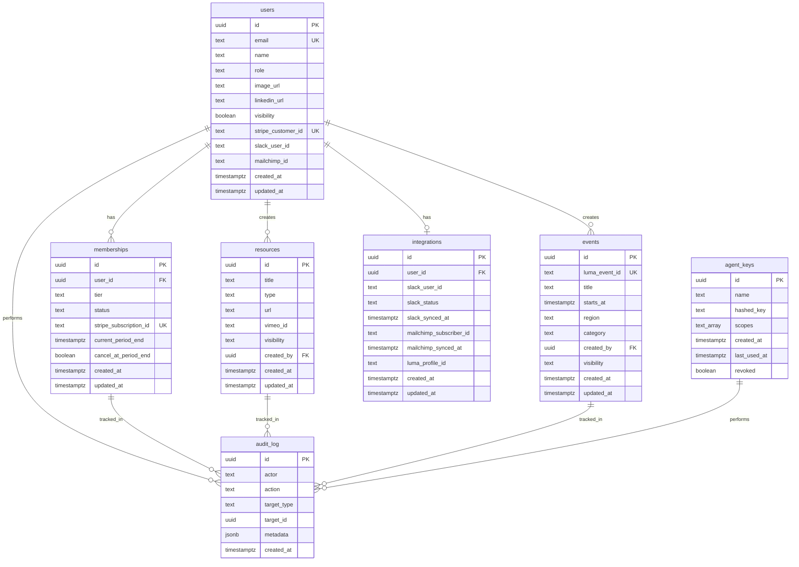

# DATABASE SCHEMA - Women Defining AI Community Platform

**Version:** 1.0
**Last Updated:** November 2, 2025
**Database:** Supabase (PostgreSQL 15+)

## Table of Contents

1. [Schema Overview](#schema-overview)
2. [Core Tables](#core-tables)
3. [Row-Level Security Policies](#row-level-security-policies)
4. [Indexes & Performance](#indexes--performance)
5. [Migration Strategy](#migration-strategy)
6. [Backup & Recovery](#backup--recovery)

---

## Schema Overview

### Database Design Principles

1. **Normalized Structure** - 3NF for data integrity
2. **UUID Primary Keys** - Globally unique identifiers
3. **Soft Deletes** - Preserve audit trail
4. **JSONB for Metadata** - Flexible schema evolution
5. **RLS from Day One** - Security by default
6. **Foreign Key Constraints** - Referential integrity
7. **Audit Everything** - Complete activity tracking

### Entity Relationship Diagram



---

## Core Tables

### 1. users

Primary user table synchronized with Clerk authentication.

```sql
CREATE TABLE users (
  id UUID PRIMARY KEY DEFAULT gen_random_uuid(),
  email TEXT UNIQUE NOT NULL,
  name TEXT NOT NULL,
  role TEXT NOT NULL DEFAULT 'visitor' CHECK (role IN ('visitor', 'member', 'leader')),
  image_url TEXT,
  linkedin_url TEXT,
  visibility BOOLEAN DEFAULT true,
  stripe_customer_id TEXT UNIQUE,
  slack_user_id TEXT,
  mailchimp_id TEXT,
  created_at TIMESTAMPTZ DEFAULT NOW(),
  updated_at TIMESTAMPTZ DEFAULT NOW()
);

-- Indexes
CREATE INDEX idx_users_email ON users(email);
CREATE INDEX idx_users_stripe_customer_id ON users(stripe_customer_id);
CREATE INDEX idx_users_role_visibility ON users(role, visibility) WHERE visibility = true;
CREATE INDEX idx_users_created_at ON users(created_at DESC);

-- Triggers
CREATE OR REPLACE FUNCTION update_updated_at()
RETURNS TRIGGER AS $$
BEGIN
  NEW.updated_at = NOW();
  RETURN NEW;
END;
$$ LANGUAGE plpgsql;

CREATE TRIGGER update_users_updated_at
BEFORE UPDATE ON users
FOR EACH ROW
EXECUTE FUNCTION update_updated_at();
```

### 2. memberships

Subscription tracking synchronized with Stripe.

```sql
CREATE TABLE memberships (
  id UUID PRIMARY KEY DEFAULT gen_random_uuid(),
  user_id UUID NOT NULL REFERENCES users(id) ON DELETE CASCADE,
  tier TEXT NOT NULL CHECK (tier IN ('monthly', 'annual', 'donor_annual')),
  status TEXT NOT NULL CHECK (status IN ('active', 'trialing', 'past_due', 'canceled')),
  stripe_subscription_id TEXT UNIQUE NOT NULL,
  current_period_end TIMESTAMPTZ NOT NULL,
  cancel_at_period_end BOOLEAN DEFAULT false,
  created_at TIMESTAMPTZ DEFAULT NOW(),
  updated_at TIMESTAMPTZ DEFAULT NOW(),

  -- Ensure one active membership per user
  CONSTRAINT unique_active_membership UNIQUE (user_id, status)
    WHERE status IN ('active', 'trialing', 'past_due')
);

-- Indexes
CREATE INDEX idx_memberships_user_id ON memberships(user_id);
CREATE INDEX idx_memberships_status ON memberships(status) WHERE status = 'active';
CREATE INDEX idx_memberships_stripe_subscription_id ON memberships(stripe_subscription_id);
CREATE INDEX idx_memberships_current_period_end ON memberships(current_period_end)
  WHERE cancel_at_period_end = true;

-- Trigger for updated_at
CREATE TRIGGER update_memberships_updated_at
BEFORE UPDATE ON memberships
FOR EACH ROW
EXECUTE FUNCTION update_updated_at();
```

### 3. resources

Gated content (videos, PDFs, links) for members and leaders.

```sql
CREATE TABLE resources (
  id UUID PRIMARY KEY DEFAULT gen_random_uuid(),
  title TEXT NOT NULL,
  description TEXT,
  type TEXT NOT NULL CHECK (type IN ('video', 'pdf', 'link')),
  url TEXT NOT NULL,
  vimeo_id TEXT,
  thumbnail_url TEXT,
  visibility TEXT NOT NULL CHECK (visibility IN ('member', 'leader')),
  tags TEXT[],
  created_by UUID NOT NULL REFERENCES users(id),
  created_at TIMESTAMPTZ DEFAULT NOW(),
  updated_at TIMESTAMPTZ DEFAULT NOW()
);

-- Indexes
CREATE INDEX idx_resources_visibility ON resources(visibility);
CREATE INDEX idx_resources_created_by ON resources(created_by);
CREATE INDEX idx_resources_type ON resources(type);
CREATE INDEX idx_resources_tags ON resources USING GIN(tags);
CREATE INDEX idx_resources_created_at ON resources(created_at DESC);

-- Trigger for updated_at
CREATE TRIGGER update_resources_updated_at
BEFORE UPDATE ON resources
FOR EACH ROW
EXECUTE FUNCTION update_updated_at();
```

### 4. events

Community events synchronized with Luma.

```sql
CREATE TABLE events (
  id UUID PRIMARY KEY DEFAULT gen_random_uuid(),
  luma_event_id TEXT UNIQUE NOT NULL,
  title TEXT NOT NULL,
  description TEXT,
  starts_at TIMESTAMPTZ NOT NULL,
  ends_at TIMESTAMPTZ,
  region TEXT,
  category TEXT,
  location_type TEXT CHECK (location_type IN ('in_person', 'virtual', 'hybrid')),
  location_details JSONB,
  max_attendees INTEGER,
  created_by UUID NOT NULL REFERENCES users(id),
  visibility TEXT NOT NULL CHECK (visibility IN ('public', 'member', 'leader')),
  created_at TIMESTAMPTZ DEFAULT NOW(),
  updated_at TIMESTAMPTZ DEFAULT NOW()
);

-- Indexes
CREATE INDEX idx_events_luma_event_id ON events(luma_event_id);
CREATE INDEX idx_events_starts_at ON events(starts_at);
CREATE INDEX idx_events_visibility ON events(visibility);
CREATE INDEX idx_events_region ON events(region) WHERE region IS NOT NULL;
CREATE INDEX idx_events_created_by ON events(created_by);

-- Trigger for updated_at
CREATE TRIGGER update_events_updated_at
BEFORE UPDATE ON events
FOR EACH ROW
EXECUTE FUNCTION update_updated_at();
```

### 5. integrations

Third-party service integration tracking.

```sql
CREATE TABLE integrations (
  id UUID PRIMARY KEY DEFAULT gen_random_uuid(),
  user_id UUID UNIQUE NOT NULL REFERENCES users(id) ON DELETE CASCADE,

  -- Slack integration
  slack_user_id TEXT,
  slack_status TEXT CHECK (slack_status IN ('active', 'inactive', 'deactivated')),
  slack_synced_at TIMESTAMPTZ,

  -- Mailchimp integration
  mailchimp_subscriber_id TEXT,
  mailchimp_tags TEXT[],
  mailchimp_synced_at TIMESTAMPTZ,

  -- Luma integration
  luma_profile_id TEXT,
  luma_synced_at TIMESTAMPTZ,

  created_at TIMESTAMPTZ DEFAULT NOW(),
  updated_at TIMESTAMPTZ DEFAULT NOW()
);

-- Indexes
CREATE INDEX idx_integrations_user_id ON integrations(user_id);
CREATE INDEX idx_integrations_slack_user_id ON integrations(slack_user_id) WHERE slack_user_id IS NOT NULL;
CREATE INDEX idx_integrations_mailchimp_subscriber_id ON integrations(mailchimp_subscriber_id)
  WHERE mailchimp_subscriber_id IS NOT NULL;

-- Trigger for updated_at
CREATE TRIGGER update_integrations_updated_at
BEFORE UPDATE ON integrations
FOR EACH ROW
EXECUTE FUNCTION update_updated_at();
```

### 6. audit_log

Comprehensive audit trail for all system activities.

```sql
CREATE TABLE audit_log (
  id UUID PRIMARY KEY DEFAULT gen_random_uuid(),
  actor TEXT NOT NULL, -- user_id, 'agent:{name}', 'system:{job}'
  action TEXT NOT NULL, -- 'member:created', 'event:approved', etc.
  target_type TEXT, -- 'user', 'event', 'resource', etc.
  target_id UUID,
  metadata JSONB DEFAULT '{}',
  ip_address INET,
  user_agent TEXT,
  created_at TIMESTAMPTZ DEFAULT NOW()
);

-- Indexes (optimized for common queries)
CREATE INDEX idx_audit_log_actor ON audit_log(actor);
CREATE INDEX idx_audit_log_action ON audit_log(action);
CREATE INDEX idx_audit_log_target ON audit_log(target_type, target_id) WHERE target_id IS NOT NULL;
CREATE INDEX idx_audit_log_created_at ON audit_log(created_at DESC);
CREATE INDEX idx_audit_log_actor_created ON audit_log(actor, created_at DESC);

-- Partition by month for performance (optional for high volume)
-- CREATE TABLE audit_log_2025_01 PARTITION OF audit_log
-- FOR VALUES FROM ('2025-01-01') TO ('2025-02-01');
```

### 7. agent_keys

API keys for agent access via MCP.

```sql
CREATE TABLE agent_keys (
  id UUID PRIMARY KEY DEFAULT gen_random_uuid(),
  name TEXT NOT NULL,
  description TEXT,
  key_prefix TEXT NOT NULL, -- First 8 chars of key for identification
  hashed_key TEXT NOT NULL, -- bcrypt hash of full key
  scopes TEXT[] NOT NULL,
  rate_limit_per_minute INTEGER DEFAULT 100,
  created_at TIMESTAMPTZ DEFAULT NOW(),
  expires_at TIMESTAMPTZ,
  last_used_at TIMESTAMPTZ,
  last_used_ip INET,
  revoked BOOLEAN DEFAULT false,
  revoked_at TIMESTAMPTZ,
  revoked_by UUID REFERENCES users(id)
);

-- Indexes
CREATE INDEX idx_agent_keys_key_prefix ON agent_keys(key_prefix) WHERE revoked = false;
CREATE INDEX idx_agent_keys_name ON agent_keys(name) WHERE revoked = false;
CREATE INDEX idx_agent_keys_expires_at ON agent_keys(expires_at)
  WHERE expires_at IS NOT NULL AND revoked = false;
```

### 8. job_idempotency

Prevent duplicate job processing.

```sql
CREATE TABLE job_idempotency (
  id UUID PRIMARY KEY DEFAULT gen_random_uuid(),
  job_type TEXT NOT NULL,
  idempotency_key TEXT NOT NULL,
  status TEXT NOT NULL CHECK (status IN ('pending', 'processing', 'completed', 'failed')),
  result JSONB,
  error TEXT,
  created_at TIMESTAMPTZ DEFAULT NOW(),
  completed_at TIMESTAMPTZ,

  CONSTRAINT unique_job_idempotency UNIQUE (job_type, idempotency_key)
);

-- Indexes
CREATE INDEX idx_job_idempotency_key ON job_idempotency(job_type, idempotency_key);
CREATE INDEX idx_job_idempotency_created_at ON job_idempotency(created_at DESC);

-- Cleanup old records (run periodically)
CREATE OR REPLACE FUNCTION cleanup_old_idempotency_keys()
RETURNS void AS $$
BEGIN
  DELETE FROM job_idempotency
  WHERE created_at < NOW() - INTERVAL '30 days'
    AND status IN ('completed', 'failed');
END;
$$ LANGUAGE plpgsql;
```

---

## Row-Level Security Policies

### Security Principles

1. **Default Deny** - No access unless explicitly granted
2. **Service Role Only** - Write operations require service role
3. **JWT Claims** - Clerk JWT claims determine access
4. **Audit Everything** - All writes logged to audit_log

### users Table RLS

```sql
-- Enable RLS
ALTER TABLE users ENABLE ROW LEVEL SECURITY;

-- Policy: Users can read their own profile
CREATE POLICY "users_read_own"
ON users FOR SELECT
TO authenticated
USING (id = (auth.jwt() ->> 'sub')::uuid);

-- Policy: Members can read visible members
CREATE POLICY "members_read_visible"
ON users FOR SELECT
TO authenticated
USING (
  visibility = true
  AND (auth.jwt() ->> 'role')::text IN ('member', 'leader')
);

-- Policy: Users can update their own profile
CREATE POLICY "users_update_own"
ON users FOR UPDATE
TO authenticated
USING (id = (auth.jwt() ->> 'sub')::uuid)
WITH CHECK (id = (auth.jwt() ->> 'sub')::uuid);

-- Policy: Service role has full access
CREATE POLICY "service_role_all"
ON users FOR ALL
TO service_role
USING (true)
WITH CHECK (true);
```

### memberships Table RLS

```sql
-- Enable RLS
ALTER TABLE memberships ENABLE ROW LEVEL SECURITY;

-- Policy: Users can read their own membership
CREATE POLICY "users_read_own_membership"
ON memberships FOR SELECT
TO authenticated
USING (user_id = (auth.jwt() ->> 'sub')::uuid);

-- Policy: Leaders can read all memberships
CREATE POLICY "leaders_read_all_memberships"
ON memberships FOR SELECT
TO authenticated
USING ((auth.jwt() ->> 'role')::text = 'leader');

-- Policy: Service role only for writes
CREATE POLICY "service_role_all"
ON memberships FOR ALL
TO service_role
USING (true)
WITH CHECK (true);
```

### resources Table RLS

```sql
-- Enable RLS
ALTER TABLE resources ENABLE ROW LEVEL SECURITY;

-- Policy: Members can read member-visible resources
CREATE POLICY "members_read_resources"
ON resources FOR SELECT
TO authenticated
USING (
  visibility = 'member'
  AND (auth.jwt() ->> 'role')::text IN ('member', 'leader')
);

-- Policy: Leaders can read all resources
CREATE POLICY "leaders_read_all"
ON resources FOR SELECT
TO authenticated
USING ((auth.jwt() ->> 'role')::text = 'leader');

-- Policy: Leaders can create resources
CREATE POLICY "leaders_create"
ON resources FOR INSERT
TO authenticated
WITH CHECK (
  (auth.jwt() ->> 'role')::text = 'leader'
  AND created_by = (auth.jwt() ->> 'sub')::uuid
);

-- Policy: Leaders can update their own resources
CREATE POLICY "leaders_update_own"
ON resources FOR UPDATE
TO authenticated
USING (
  created_by = (auth.jwt() ->> 'sub')::uuid
  AND (auth.jwt() ->> 'role')::text = 'leader'
)
WITH CHECK (
  created_by = (auth.jwt() ->> 'sub')::uuid
  AND (auth.jwt() ->> 'role')::text = 'leader'
);

-- Policy: Leaders can delete their own resources
CREATE POLICY "leaders_delete_own"
ON resources FOR DELETE
TO authenticated
USING (
  created_by = (auth.jwt() ->> 'sub')::uuid
  AND (auth.jwt() ->> 'role')::text = 'leader'
);
```

### events Table RLS

```sql
-- Enable RLS
ALTER TABLE events ENABLE ROW LEVEL SECURITY;

-- Policy: Public events visible to all
CREATE POLICY "public_events_read"
ON events FOR SELECT
TO authenticated, anon
USING (visibility = 'public');

-- Policy: Members can read member events
CREATE POLICY "members_read_events"
ON events FOR SELECT
TO authenticated
USING (
  visibility IN ('public', 'member')
  AND (auth.jwt() ->> 'role')::text IN ('member', 'leader')
);

-- Policy: Leaders can read all events
CREATE POLICY "leaders_read_all_events"
ON events FOR SELECT
TO authenticated
USING ((auth.jwt() ->> 'role')::text = 'leader');

-- Policy: Leaders can create events
CREATE POLICY "leaders_create_events"
ON events FOR INSERT
TO authenticated
WITH CHECK (
  (auth.jwt() ->> 'role')::text = 'leader'
  AND created_by = (auth.jwt() ->> 'sub')::uuid
);

-- Policy: Leaders can update their own events
CREATE POLICY "leaders_update_own_events"
ON events FOR UPDATE
TO authenticated
USING (
  created_by = (auth.jwt() ->> 'sub')::uuid
  AND (auth.jwt() ->> 'role')::text = 'leader'
);
```

### integrations Table RLS

```sql
-- Enable RLS
ALTER TABLE integrations ENABLE ROW LEVEL SECURITY;

-- Policy: Users can read their own integrations
CREATE POLICY "users_read_own_integrations"
ON integrations FOR SELECT
TO authenticated
USING (user_id = (auth.jwt() ->> 'sub')::uuid);

-- Policy: Service role only for writes
CREATE POLICY "service_role_all"
ON integrations FOR ALL
TO service_role
USING (true)
WITH CHECK (true);
```

### audit_log Table RLS

```sql
-- Enable RLS
ALTER TABLE audit_log ENABLE ROW LEVEL SECURITY;

-- No public access - service role only
CREATE POLICY "service_role_only"
ON audit_log FOR ALL
TO service_role
USING (true)
WITH CHECK (true);
```

### agent_keys Table RLS

```sql
-- Enable RLS
ALTER TABLE agent_keys ENABLE ROW LEVEL SECURITY;

-- No public access - service role only
CREATE POLICY "service_role_only"
ON agent_keys FOR ALL
TO service_role
USING (true)
WITH CHECK (true);
```

---

## Indexes & Performance

### Query Optimization Strategy

1. **Covering Indexes** - Include all columns needed by common queries
2. **Partial Indexes** - Filter to reduce index size
3. **GIN Indexes** - For JSONB and array searches
4. **BRIN Indexes** - For time-series data (audit_log)

### Performance-Critical Indexes

```sql
-- Composite indexes for common queries
CREATE INDEX idx_users_role_visibility_created
ON users(role, visibility, created_at DESC)
WHERE visibility = true;

CREATE INDEX idx_memberships_user_status_tier
ON memberships(user_id, status, tier)
WHERE status = 'active';

CREATE INDEX idx_resources_visibility_type_created
ON resources(visibility, type, created_at DESC);

CREATE INDEX idx_events_visibility_starts_region
ON events(visibility, starts_at, region)
WHERE starts_at > NOW();

-- JSONB indexes
CREATE INDEX idx_events_location_details
ON events USING GIN(location_details);

CREATE INDEX idx_audit_log_metadata
ON audit_log USING GIN(metadata);

-- Text search indexes (optional)
CREATE INDEX idx_resources_title_search
ON resources USING GIN(to_tsvector('english', title));

CREATE INDEX idx_events_title_search
ON events USING GIN(to_tsvector('english', title));
```

### Query Performance Monitoring

```sql
-- Enable query performance monitoring
CREATE EXTENSION IF NOT EXISTS pg_stat_statements;

-- View slow queries
SELECT
  query,
  calls,
  total_time,
  mean_time,
  max_time
FROM pg_stat_statements
WHERE mean_time > 100 -- queries taking >100ms
ORDER BY mean_time DESC
LIMIT 20;

-- Table size monitoring
SELECT
  schemaname,
  tablename,
  pg_size_pretty(pg_total_relation_size(schemaname||'.'||tablename)) AS size,
  pg_size_pretty(pg_relation_size(schemaname||'.'||tablename)) AS data_size
FROM pg_tables
WHERE schemaname = 'public'
ORDER BY pg_total_relation_size(schemaname||'.'||tablename) DESC;
```

---

## Migration Strategy

### Migration Principles

1. **Forward-Only** - No rollback migrations
2. **Idempotent** - Can run multiple times safely
3. **Versioned** - Sequential numbering
4. **Tested** - Run in staging first
5. **Atomic** - All or nothing

### Migration File Structure

```
supabase/migrations/
├── 001_initial_schema.sql
├── 002_add_rls_policies.sql
├── 003_create_indexes.sql
├── 004_add_job_idempotency.sql
└── 005_add_agent_keys_rate_limit.sql
```

### Migration Template

```sql
-- Migration: 006_add_feature_name.sql
-- Description: Add new feature tables and policies
-- Author: Developer Name
-- Date: 2025-01-15

BEGIN;

-- Add new columns/tables
ALTER TABLE users ADD COLUMN IF NOT EXISTS feature_flag BOOLEAN DEFAULT false;

-- Add indexes
CREATE INDEX IF NOT EXISTS idx_users_feature_flag
ON users(feature_flag) WHERE feature_flag = true;

-- Add RLS policies
CREATE POLICY IF NOT EXISTS "feature_flag_policy"
ON users FOR SELECT
TO authenticated
USING (feature_flag = true);

-- Migrate data if needed
UPDATE users SET feature_flag = true WHERE role = 'leader';

COMMIT;
```

### Migration Execution

```bash
# Local development
npx supabase migration up

# Staging
npx supabase db push --db-url $STAGING_DATABASE_URL

# Production (via CI/CD)
npx supabase db push --db-url $PRODUCTION_DATABASE_URL
```

---

## Backup & Recovery

### Backup Strategy

1. **Automated Daily Backups** - Supabase built-in (Point-in-Time Recovery)
2. **Weekly Exports** - Full database dumps to S3
3. **Monthly Archives** - Long-term storage
4. **Replication** - Read replica for disaster recovery

### Backup Implementation

```sql
-- Create backup schema for soft deletes
CREATE SCHEMA IF NOT EXISTS backup;

-- Function to backup deleted records
CREATE OR REPLACE FUNCTION backup_deleted_record()
RETURNS TRIGGER AS $$
BEGIN
  EXECUTE format('INSERT INTO backup.%I SELECT $1.*', TG_TABLE_NAME) USING OLD;
  RETURN OLD;
END;
$$ LANGUAGE plpgsql;

-- Apply to critical tables
CREATE TRIGGER backup_users_before_delete
BEFORE DELETE ON users
FOR EACH ROW
EXECUTE FUNCTION backup_deleted_record();
```

### Recovery Procedures

```sql
-- Point-in-time recovery (Supabase dashboard)
-- Restore to specific timestamp

-- Manual recovery from backup schema
INSERT INTO users
SELECT * FROM backup.users
WHERE id = 'specific-uuid';

-- Verify data integrity after recovery
SELECT
  'users' as table_name,
  COUNT(*) as row_count,
  MAX(created_at) as latest_record
FROM users
UNION ALL
SELECT
  'memberships',
  COUNT(*),
  MAX(created_at)
FROM memberships;
```

### Disaster Recovery Plan

1. **RTO (Recovery Time Objective)**: 4 hours
2. **RPO (Recovery Point Objective)**: 1 hour
3. **Backup Testing**: Monthly restore drills
4. **Failover Process**: Documented in runbooks

---

## Monitoring & Alerts

### Database Health Checks

```sql
-- Connection pool monitoring
SELECT
  numbackends as active_connections,
  (SELECT setting FROM pg_settings WHERE name = 'max_connections') as max_connections
FROM pg_stat_database
WHERE datname = current_database();

-- Table bloat check
SELECT
  schemaname,
  tablename,
  pg_size_pretty(pg_total_relation_size(schemaname||'.'||tablename)) AS total_size,
  n_dead_tup,
  n_live_tup,
  round(100 * n_dead_tup / NULLIF(n_live_tup + n_dead_tup, 0), 2) AS dead_percentage
FROM pg_stat_user_tables
WHERE n_dead_tup > 1000
ORDER BY n_dead_tup DESC;

-- Long-running queries
SELECT
  pid,
  age(clock_timestamp(), query_start) AS duration,
  query
FROM pg_stat_activity
WHERE state = 'active'
  AND query_start < clock_timestamp() - interval '5 minutes'
ORDER BY duration DESC;
```

### Alert Thresholds

- **Connection Pool**: Alert at 80% capacity
- **Table Bloat**: Alert when dead tuples > 20%
- **Query Duration**: Alert for queries > 30 seconds
- **Disk Space**: Alert at 80% usage
- **Replication Lag**: Alert at > 10 seconds

---

## Security Considerations

### Data Protection

1. **Encryption at Rest** - Supabase default (AES-256)
2. **Encryption in Transit** - TLS 1.3
3. **Column Encryption** - For sensitive fields (future)
4. **Data Masking** - For non-production environments

### Access Control

1. **Service Role** - Server-side operations only
2. **Anon Key** - Public read operations
3. **RLS Policies** - Row-level access control
4. **JWT Claims** - User role validation
5. **API Keys** - Scoped agent access

### Compliance

1. **GDPR** - Right to erasure, data portability
2. **CCPA** - California privacy rights
3. **Audit Trail** - Complete activity logging
4. **Data Retention** - 7-year audit log retention

---

**Next Steps:**
1. Review and approve schema design
2. Create initial migration files
3. Set up development database
4. Implement RLS policy tests
5. Configure backup automation