# INTEGRATION FLOWS - Women Defining AI Community Platform

**Version:** 1.0
**Last Updated:** November 2, 2025

## Table of Contents

1. [Integration Overview](#integration-overview)
2. [Member Lifecycle Flow](#member-lifecycle-flow)
3. [Payment Processing Flow](#payment-processing-flow)
4. [Email Automation Flow](#email-automation-flow)
5. [Event Management Flow](#event-management-flow)
6. [Slack Synchronization Flow](#slack-synchronization-flow)
7. [Agent API Flow](#agent-api-flow)
8. [Error Recovery Flows](#error-recovery-flows)

---

## Integration Overview

### System Integration Map


---

## Member Lifecycle Flow

### New Member Signup Flow


### Member Cancellation Flow


---

## Payment Processing Flow

### Stripe Webhook Processing


### Payment Retry Logic


---

## Email Automation Flow

### Mailchimp Integration


### Welcome Series Timeline

```mermaid
gantt
    title New Member Welcome Series
    dateFormat HH:mm
    axisFormat %H:%M

    section Day 0
    Welcome Email          :done, welcome, 00:00, 1h

    section Day 1
    Getting Started        :done, start, 24:00, 1h

    section Day 3
    Member Benefits        :done, benefits, 72:00, 1h

    section Day 7
    Community Introduction :done, community, 168:00, 1h

    section Day 14
    First Event Invite     :done, event, 336:00, 1h

    section Day 30
    Check-in Survey        :done, survey, 720:00, 1h
```

---

## Event Management Flow

### Luma Event Creation (Leader)


### Luma Auto-Approval Flow (2× Daily)


---

## Slack Synchronization Flow

### Status Sync Flow (2× Daily)


### Slack Status States


---

## Agent API Flow

### Agent Authentication & Request Flow


### Agent Scope Verification


---

## Error Recovery Flows

### Webhook Failure Recovery


### Job Failure Recovery


### Compensation Strategies

| Service | Failure Type | Compensation Action |
|---------|-------------|-------------------|
| Stripe | Webhook missed | Replay from Stripe dashboard |
| Mailchimp | Sync failed | Manual batch sync |
| Luma | API timeout | Retry with backoff |
| Slack | Rate limited | Defer to next sync |
| Database | Connection lost | Circuit breaker + retry |

---

## Monitoring & Alerting

### Integration Health Dashboard

```mermaid
graph TB
    subgraph "Service Health"
        S1[Stripe: ✅]
        S2[Clerk: ✅]
        S3[Mailchimp: ⚠️]
        S4[Luma: ✅]
        S5[Slack: ❌]
    end

    subgraph "Job Status"
        J1[mailchimp_sync: 142 succeeded]
        J2[luma_approval: 28 approved]
        J3[slack_sync: 3 failed]
    end

    subgraph "Webhook Metrics"
        W1[Stripe: 99.8% success]
        W2[Processing time: p95 < 2s]
        W3[DLQ: 2 items]
    end

    subgraph "Alerts"
        A1[🔴 Slack API down]
        A2[🟡 Mailchimp rate limit warning]
        A3[🟢 All systems operational]
    end
```



### Alert Thresholds

| Metric | Warning | Critical | Action |
|--------|---------|----------|--------|
| Webhook success rate | < 99% | < 95% | Check DLQ, review logs |
| Job failure rate | > 5% | > 10% | Investigate root cause |
| API response time | > 500ms | > 2000ms | Scale resources |
| DLQ items | > 10 | > 50 | Manual intervention |
| Rate limit hits | > 10/hour | > 100/hour | Adjust limits |

---

## Security Considerations

### Integration Security Matrix

| Integration | Auth Method | Security Measures |
|------------|-------------|------------------|
| Stripe | Webhook signature | HMAC verification, idempotency |
| Clerk | JWT + webhook sig | Token validation, RBAC |
| Mailchimp | API key | Rate limiting, IP whitelist |
| Luma | API key | Scope limitation |
| Slack | OAuth token | Minimal scopes, read-only |
| Agents | API key | Scoped access, rate limits |

### Data Flow Security


---

**Next Steps:**
1. Implement webhook handlers with proper error recovery
2. Set up Inngest for job orchestration
3. Configure rate limiting for all integrations
4. Create monitoring dashboards
5. Document runbooks for failure scenarios