# JOB ORCHESTRATION - Women Defining AI Community Platform

**Version:** 1.0
**Last Updated:** November 2, 2025

## Table of Contents

1. [Executive Summary & Recommendation](#executive-summary--recommendation)
2. [Job Requirements Analysis](#job-requirements-analysis)
3. [Inngest vs Supabase Edge Functions Comparison](#inngest-vs-supabase-edge-functions-comparison)
4. [Recommended Architecture](#recommended-architecture)
5. [Job Implementation Patterns](#job-implementation-patterns)
6. [Job Scheduling Strategy](#job-scheduling-strategy)
7. [Error Handling & Recovery](#error-handling--recovery)
8. [Monitoring & Observability](#monitoring--observability)

---

## Executive Summary & Recommendation

### 🎯 RECOMMENDATION: Use Inngest for Complex Jobs + Vercel Cron for Simple Jobs

**Rationale:**
1. **Inngest** handles complex workflows (Stripe → DB → Mailchimp) with built-in retries, observability, and replay capabilities
2. **Vercel Cron** handles simple, idempotent jobs (Luma approval, Slack sync) that don't need complex orchestration
3. This hybrid approach minimizes complexity while ensuring reliability

**Decision Matrix:**

| Criteria | Inngest | Supabase Edge + pgcron | Winner |
|----------|---------|------------------------|--------|
| Developer Experience | Excellent UI, easy debugging | Manual setup required | Inngest ✅ |
| Retry Logic | Built-in with exponential backoff | Manual implementation | Inngest ✅ |
| Job Replay | One-click replay from UI | Manual database operations | Inngest ✅ |
| Observability | Built-in dashboard | Custom logging needed | Inngest ✅ |
| Complex Workflows | Step functions, fan-out | Basic scheduling only | Inngest ✅ |
| Cost | $0-29/mo for MVP scale | Included with Supabase | Supabase ✅ |
| Vendor Lock-in | Moderate (can migrate) | Low (standard Postgres) | Supabase ✅ |
| Time to Market | Fast (hours) | Slower (days) | Inngest ✅ |

**Winner: Inngest (6-2)** for MVP, with migration path to Supabase Edge if needed at scale.

---

## Job Requirements Analysis

### Required Jobs

| Job Name | Type | Frequency | Complexity | Retry Needed | Recommendation |
|----------|------|-----------|------------|--------------|----------------|
| Mailchimp Member Sync | Event-driven | On webhook | High | Yes | Inngest |
| Member Deactivation | Scheduled | At specific time | Medium | Yes | Inngest |
| Luma Auto-Approval | Cron | 2× daily | Low | No | Vercel Cron |
| Slack Status Sync | Cron | 2× daily | Low | No | Vercel Cron |
| Database Cleanup | Cron | Nightly | Low | No | Vercel Cron |
| Webhook Retry | Event-driven | On failure | High | Yes | Inngest |

### Job Complexity Analysis


---

## Inngest vs Supabase Edge Functions Comparison

### Architecture Comparison

#### Option 1: Inngest Architecture

```mermaid
graph TB
    subgraph "Trigger Layer"
        W[Webhook]
        C[Cron]
        E[Event]
    end

    subgraph "Inngest Cloud"
        Q[Event Queue]
        O[Orchestrator]
        R[Retry Logic]
        D[Dashboard]
    end

    subgraph "Your Infrastructure"
        H[/api/inngest]
        F[Job Functions]
        DB[(Database)]
    end

    W --> H
    C --> H
    E --> H
    H --> Q
    Q --> O
    O --> F
    F --> DB
    O --> R
    R --> F
    O --> D
```

#### Option 2: Supabase Edge Functions Architecture


### Feature Comparison

| Feature | Inngest | Supabase Edge Functions |
|---------|---------|------------------------|
| **Setup Time** | 30 minutes | 2-3 days |
| **Retry Logic** | Automatic with backoff | Manual implementation |
| **Dead Letter Queue** | Built-in | Manual setup |
| **Job Replay** | One-click from UI | Manual SQL commands |
| **Step Functions** | Yes, with branching | No, linear only |
| **Fan-out/Fan-in** | Built-in | Manual orchestration |
| **Rate Limiting** | Built-in | Manual implementation |
| **Observability** | Real-time dashboard | CloudFlare Analytics |
| **Local Development** | Inngest Dev Server | Supabase CLI |
| **Debugging** | Step-by-step replay | Console logs |
| **Cost at 10K jobs/mo** | $0 (free tier) | $0 (included) |
| **Cost at 100K jobs/mo** | $29/mo | $0 (included) |
| **Cost at 1M jobs/mo** | $299/mo | $0 (included) |

---

## Recommended Architecture

### Hybrid Approach: Inngest + Vercel Cron


### Implementation Timeline


---

## Job Implementation Patterns

### Inngest Job Pattern

```typescript
// src/lib/jobs/mailchimp-sync.ts
import { inngest } from './client'
import { z } from 'zod'

const EventSchema = z.object({
  userId: z.string().uuid(),
  stripeEventId: z.string(),
  action: z.enum(['create', 'update', 'cancel'])
})

export const mailchimpSync = inngest.createFunction(
  {
    id: 'mailchimp-sync',
    name: 'Sync Member to Mailchimp',
    throttle: {
      limit: 100,
      period: '1m',
      key: 'event.data.userId'
    },
    retries: 3
  },
  { event: 'member.updated' },
  async ({ event, step }) => {
    // Step 1: Validate event
    const data = EventSchema.parse(event.data)

    // Step 2: Check idempotency
    const processed = await step.run('check-idempotency', async () => {
      return await checkIdempotency(data.stripeEventId)
    })

    if (processed) {
      return { status: 'already_processed' }
    }

    // Step 3: Fetch user data
    const user = await step.run('fetch-user', async () => {
      return await getUserWithMembership(data.userId)
    })

    // Step 4: Sync to Mailchimp
    const result = await step.run('sync-mailchimp', async () => {
      return await mailchimp.lists.setListMember(
        process.env.MAILCHIMP_LIST_ID,
        user.email,
        {
          email_address: user.email,
          status: user.membership?.status === 'active' ? 'subscribed' : 'unsubscribed',
          merge_fields: { FNAME: user.name },
          tags: generateTags(user.membership)
        }
      )
    })

    // Step 5: Trigger automation (if new)
    if (data.action === 'create') {
      await step.run('trigger-welcome', async () => {
        return await mailchimp.automations.trigger(
          process.env.MAILCHIMP_WELCOME_ID,
          user.email
        )
      })
    }

    // Step 6: Audit log
    await step.run('audit-log', async () => {
      return await createAuditLog({
        actor: 'system:mailchimp_sync',
        action: `mailchimp:${data.action}`,
        target_type: 'user',
        target_id: data.userId,
        metadata: { mailchimp_id: result.id }
      })
    })

    // Step 7: Mark as processed
    await step.run('mark-processed', async () => {
      return await storeIdempotency(data.stripeEventId)
    })

    return { status: 'success', mailchimpId: result.id }
  }
)
```

### Scheduled Job Pattern (Inngest)

```typescript
// src/lib/jobs/member-deactivation.ts
export const memberDeactivation = inngest.createFunction(
  {
    id: 'member-deactivation',
    name: 'Deactivate Member at Period End'
  },
  { event: 'member.schedule_deactivation' },
  async ({ event, step }) => {
    const { userId, deactivateAt } = event.data

    // Wait until deactivation time
    await step.sleep('wait-until-deactivation', deactivateAt)

    // Check if still should deactivate
    const shouldDeactivate = await step.run('check-status', async () => {
      const membership = await getMembership(userId)
      return membership?.status !== 'active'
    })

    if (!shouldDeactivate) {
      return { status: 'reactivated' }
    }

    // Perform deactivation steps
    await step.run('update-database', async () => {
      await updateMembershipStatus(userId, 'canceled')
      await updateUserVisibility(userId, false)
    })

    await step.run('update-mailchimp', async () => {
      await updateMailchimpTags(userId, {
        remove: ['active'],
        add: ['alumni']
      })
    })

    await step.run('audit-log', async () => {
      await createAuditLog({
        actor: 'system:deactivation',
        action: 'member:deactivated',
        target_type: 'user',
        target_id: userId
      })
    })

    return { status: 'deactivated' }
  }
)
```

### Simple Cron Job Pattern (Vercel)

```typescript
// src/app/api/jobs/luma-auto-approve/route.ts
export async function GET(req: Request) {
  // Verify cron secret
  const authHeader = req.headers.get('authorization')
  if (authHeader !== `Bearer ${process.env.CRON_SECRET}`) {
    return Response.json({ error: 'Unauthorized' }, { status: 401 })
  }

  const results = {
    processed: 0,
    approved: 0,
    denied: 0,
    errors: []
  }

  try {
    // Simple, single-step operation
    const pendingRSVPs = await luma.getRSVPs({ status: 'pending' })

    for (const rsvp of pendingRSVPs) {
      try {
        const isActive = await checkMembership(rsvp.email)

        if (isActive) {
          await luma.approveRSVP(rsvp.id)
          results.approved++
        } else {
          results.denied++
        }

        results.processed++
      } catch (error) {
        results.errors.push({ rsvp: rsvp.id, error: error.message })
      }
    }

    await createAuditLog({
      actor: 'system:luma_approval',
      action: 'job:completed',
      metadata: results
    })

    return Response.json({ success: true, ...results })
  } catch (error) {
    return Response.json({ error: error.message }, { status: 500 })
  }
}
```

---

## Job Scheduling Strategy

### Scheduling Decision Tree


### Job Configuration

```typescript
// inngest.config.ts
export const jobConfig = {
  // Complex jobs with Inngest
  inngest: {
    mailchimpSync: {
      trigger: 'event',
      event: 'member.updated',
      retries: 3,
      timeout: '5m',
      rateLimit: '100/1m'
    },
    memberDeactivation: {
      trigger: 'scheduled',
      retries: 3,
      timeout: '2m'
    },
    webhookRetry: {
      trigger: 'event',
      event: 'webhook.failed',
      retries: 5,
      backoff: 'exponential'
    }
  },

  // Simple jobs with Vercel Cron
  cron: {
    lumaApproval: {
      schedule: '0 9,21 * * *',  // 9am and 9pm UTC
      timeout: 60,                // seconds
      retries: 0                   // Idempotent, no retry needed
    },
    slackSync: {
      schedule: '0 10,22 * * *',  // 10am and 10pm UTC
      timeout: 120,
      retries: 0
    },
    cleanup: {
      schedule: '0 3 * * *',      // 3am UTC daily
      timeout: 300,
      retries: 0
    }
  }
}
```

---

## Error Handling & Recovery

### Error Handling Strategy


### Inngest Error Recovery

```typescript
// Built-in retry with exponential backoff
export const robustJob = inngest.createFunction(
  {
    id: 'robust-job',
    retries: {
      attempts: 5,
      backoff: 'exponential' // 1s, 2s, 4s, 8s, 16s
    },
    onFailure: async ({ error, event, attempt }) => {
      // Send to DLQ after max retries
      if (attempt === 5) {
        await sendToDeadLetterQueue({
          job: 'robust-job',
          event,
          error: error.message
        })

        await notifyOps({
          severity: 'high',
          message: `Job failed after 5 attempts: ${error.message}`
        })
      }
    }
  },
  { event: 'data.process' },
  async ({ event, step }) => {
    // Job logic with automatic retry
  }
)
```

### Manual Intervention Workflow

```typescript
// DLQ processor for manual review
export async function processDeadLetterQueue() {
  const items = await getDeadLetterItems()

  for (const item of items) {
    const action = await determineAction(item)

    switch (action) {
      case 'replay':
        await inngest.send({
          name: item.event,
          data: item.data
        })
        break

      case 'compensate':
        await executeCompensation(item)
        break

      case 'abandon':
        await markAsAbandoned(item)
        break
    }
  }
}
```

---

## Monitoring & Observability

### Inngest Dashboard Metrics

```mermaid
graph LR
    subgraph "Function Metrics"
        M1[Total Runs: 10,432]
        M2[Success Rate: 99.2%]
        M3[Avg Duration: 1.2s]
        M4[P95 Duration: 3.5s]
    end

    subgraph "Current Status"
        S1[Running: 3]
        S2[Queued: 12]
        S3[Failed: 2]
        S4[Completed: 10,415]
    end

    subgraph "Error Tracking"
        E1[Last Error: 2min ago]
        E2[Error Rate: 0.8%]
        E3[DLQ Items: 5]
    end

    subgraph "Alerts"
        A1[High Error Rate ⚠️]
        A2[Long Queue ✓]
        A3[Performance ✓]
    end
```



### Custom Monitoring Implementation

```typescript
// src/lib/monitoring/job-metrics.ts
export class JobMetrics {
  private static metrics = new Map<string, JobMetric>()

  static recordStart(jobName: string, jobId: string) {
    this.metrics.set(jobId, {
      name: jobName,
      startTime: Date.now(),
      status: 'running'
    })
  }

  static recordSuccess(jobId: string, metadata?: any) {
    const metric = this.metrics.get(jobId)
    if (metric) {
      metric.endTime = Date.now()
      metric.duration = metric.endTime - metric.startTime
      metric.status = 'success'
      metric.metadata = metadata

      // Send to monitoring service
      await sendToDatadog({
        metric: 'job.duration',
        value: metric.duration,
        tags: [`job:${metric.name}`, 'status:success']
      })
    }
  }

  static recordFailure(jobId: string, error: Error) {
    const metric = this.metrics.get(jobId)
    if (metric) {
      metric.status = 'failed'
      metric.error = error.message

      // Alert on failure
      await sendToSentry(error, {
        tags: {
          job: metric.name,
          duration: Date.now() - metric.startTime
        }
      })
    }
  }

  static async getHealthStatus(): Promise<HealthStatus> {
    const recentMetrics = Array.from(this.metrics.values())
      .filter(m => m.startTime > Date.now() - 3600000) // Last hour

    const successRate = recentMetrics.filter(m => m.status === 'success').length /
                       recentMetrics.length

    return {
      healthy: successRate > 0.95,
      successRate,
      totalJobs: recentMetrics.length,
      avgDuration: avg(recentMetrics.map(m => m.duration))
    }
  }
}
```

### Alert Configuration

```yaml
# monitoring/alerts.yaml
alerts:
  - name: job_failure_rate_high
    condition: failure_rate > 0.1
    window: 5m
    severity: warning
    notify:
      - slack: "#eng-alerts"
      - email: "oncall@wdai.org"

  - name: job_queue_backup
    condition: queued_jobs > 100
    window: 10m
    severity: critical
    notify:
      - pagerduty: "job-queue-critical"

  - name: mailchimp_sync_failing
    condition: job_name = "mailchimp-sync" AND failure_count > 5
    window: 15m
    severity: high
    notify:
      - slack: "#eng-alerts"
      - sms: "+1234567890"

  - name: dlq_items_accumulating
    condition: dlq_count > 20
    window: 30m
    severity: medium
    notify:
      - email: "engineering@wdai.org"
```

---

## Migration Strategy (Future)

### Phase 1: Start with Inngest (Weeks 1-11)
- Quick setup, focus on business logic
- Built-in observability
- Rapid iteration

### Phase 2: Evaluate at Scale (Month 3)
- Monitor costs
- Assess vendor lock-in concerns
- Measure actual job volumes

### Phase 3: Potential Migration (Month 6+)
If needed, migrate to Supabase Edge Functions:


---

**Next Steps:**
1. Set up Inngest account and SDK
2. Implement first job (mailchimp-sync)
3. Configure Vercel cron jobs
4. Set up monitoring dashboards
5. Create runbooks for job failures
6. Test error recovery scenarios