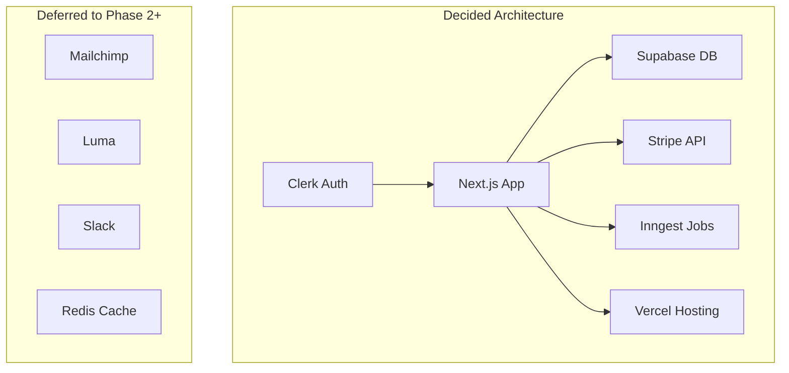
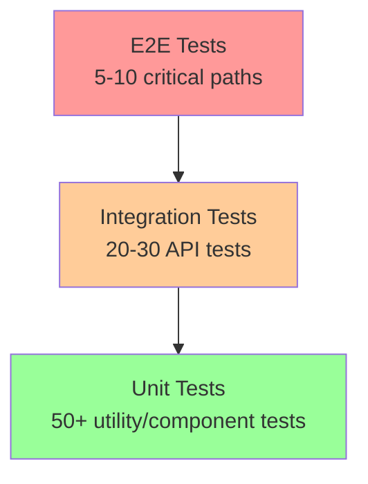
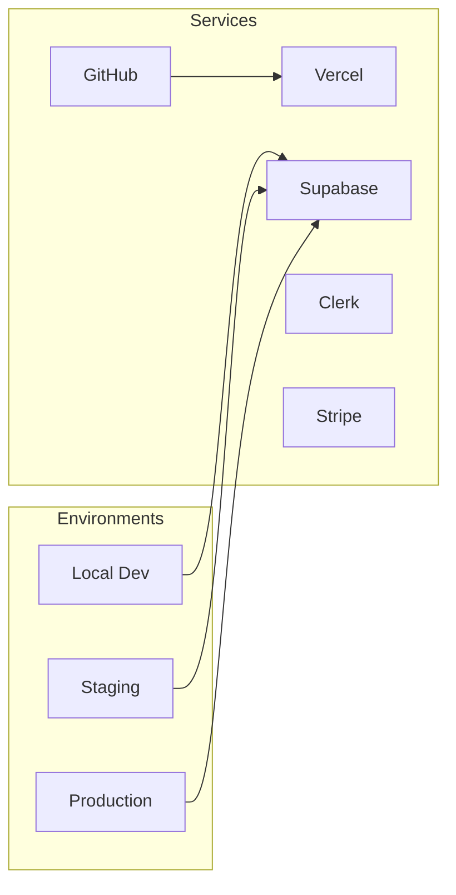

# PHASE 1 IMPLEMENTATION PLAN - Women Defining AI Community Platform

**Version:** 1.0
**Last Updated:** November 2, 2025
**Duration:** Weeks 1-2 (10 business days)
**Team:** 2 Developers

## Table of Contents

1. [Phase 1 Objectives](#phase-1-objectives)
2. [Success Criteria](#success-criteria)
3. [Week 1 Sprint Plan](#week-1-sprint-plan)
4. [Week 2 Sprint Plan](#week-2-sprint-plan)
5. [Daily Task Breakdown](#daily-task-breakdown)
6. [Technical Decisions](#technical-decisions)
7. [Risk Mitigation](#risk-mitigation)
8. [Testing Strategy](#testing-strategy)
9. [DevOps Requirements](#devops-requirements)
10. [Handoff Checklist](#handoff-checklist)

---

## Phase 1 Objectives

### Primary Goals
1. ✅ **Running application with authentication** - Users can sign up and log in
2. ✅ **Stripe integration working** - Purchase creates user/membership in database
3. ✅ **CI/CD pipeline active** - Automated testing and deployment
4. ✅ **Database schema deployed** - All tables with RLS policies
5. ✅ **Job orchestration decided** - Inngest vs Supabase Edge chosen

### Deliverables
- Next.js application deployed to Vercel
- Clerk authentication integrated
- Supabase database with schema and RLS
- Stripe Checkout and webhook handling
- Basic public pages (landing, pricing)
- CI/CD with GitHub Actions
- Documentation and runbooks started

---

## Success Criteria

### Must Have (P0)
- [ ] User can sign up via Clerk
- [ ] User can purchase subscription via Stripe
- [ ] Purchase creates user + membership records
- [ ] Webhook signature verification works
- [ ] CI pipeline runs on every PR
- [ ] Application deploys to Vercel

### Should Have (P1)
- [ ] Idempotency for webhook processing
- [ ] Basic error handling and logging
- [ ] Sentry error tracking configured
- [ ] Environment variables documented
- [ ] Local development setup documented

### Nice to Have (P2)
- [ ] OpenAPI spec skeleton created
- [ ] Unit tests for critical paths
- [ ] Inngest SDK integrated
- [ ] Rate limiting implemented

---

## Week 1 Sprint Plan

### Sprint Goal
**"Foundation Sprint"** - Get core infrastructure running with auth and database

### Team Allocation

**Developer 1 (Backend Focus):**
- Supabase setup and schema
- RLS policies
- Database migrations
- API route structure

**Developer 2 (Frontend Focus):**
- Next.js scaffold
- Clerk integration
- Public pages
- UI components setup

### Week 1 Deliverables

```mermaid
gantt
    title Week 1 Sprint (Days 1-5)
    dateFormat DD
    axisFormat %d

    section Dev 1 (Backend)
    Project Setup           :d1, 01, 1d
    Supabase Config        :d2, 01, 1d
    Database Schema        :d3, 02, 2d
    RLS Policies           :d4, 04, 1d
    Migrations             :d5, 05, 1d

    section Dev 2 (Frontend)
    Next.js Scaffold       :f1, 01, 1d
    Clerk Integration      :f2, 02, 1d
    Public Pages           :f3, 03, 2d
    UI Components          :f4, 05, 1d

    section Joint Tasks
    Integration Testing    :j1, 05, 1d
```



---

## Week 2 Sprint Plan

### Sprint Goal
**"Payment Sprint"** - Complete Stripe integration and webhook processing

### Team Allocation

**Developer 1 (Backend Focus):**
- Stripe webhook handler
- Idempotency implementation
- Job orchestration setup
- API testing

**Developer 2 (Frontend Focus):**
- Stripe Checkout integration
- Customer Portal setup
- Member dashboard skeleton
- E2E testing setup

### Week 2 Deliverables

```mermaid
gantt
    title Week 2 Sprint (Days 6-10)
    dateFormat DD
    axisFormat %d

    section Dev 1 (Backend)
    Stripe Webhooks        :d6, 06, 2d
    Idempotency           :d7, 08, 1d
    Inngest Setup         :d8, 09, 1d
    API Tests             :d9, 10, 1d

    section Dev 2 (Frontend)
    Stripe Checkout       :f5, 06, 2d
    Customer Portal       :f6, 08, 1d
    Member Dashboard      :f7, 09, 1d
    E2E Tests            :f8, 10, 1d

    section Joint Tasks
    DevOps & CI/CD       :j2, 08, 1d
    Documentation        :j3, 10, 1d
```



---

## Daily Task Breakdown

### Day 1 (Monday) - Project Initialization

**Morning Standup (30 min)**
- Review requirements
- Confirm tech stack decisions
- Assign initial tasks

**Developer 1 Tasks:**
```bash
# 1. Initialize repository
git init wdai-community-platform
cd wdai-community-platform

# 2. Create initial structure
mkdir -p docs/architecture src tests

# 3. Setup Supabase project
npx supabase init
npx supabase start

# 4. Configure environment
cp .env.local.example .env.local
```

**Developer 2 Tasks:**
```bash
# 1. Create Next.js app
npx create-next-app@latest . --typescript --app --tailwind

# 2. Install core dependencies
npm install @clerk/nextjs @supabase/supabase-js stripe zod

# 3. Setup folder structure
mkdir -p src/app/api src/components src/lib

# 4. Configure TypeScript paths
# Update tsconfig.json with aliases
```

**End of Day Checklist:**
- [ ] Repository created and both devs have access
- [ ] Basic project structure in place
- [ ] Dependencies installed
- [ ] Environment variables configured locally

---

### Day 2 (Tuesday) - Auth & Database Schema

**Developer 1 Tasks:**
```sql
-- Create database schema
CREATE TABLE users (
  id UUID PRIMARY KEY,
  email TEXT UNIQUE NOT NULL,
  name TEXT NOT NULL,
  role TEXT DEFAULT 'visitor',
  -- etc.
);

CREATE TABLE memberships (
  id UUID PRIMARY KEY,
  user_id UUID REFERENCES users(id),
  tier TEXT NOT NULL,
  status TEXT NOT NULL,
  -- etc.
);

-- Add RLS policies
ALTER TABLE users ENABLE ROW LEVEL SECURITY;
-- Add policies...
```

**Developer 2 Tasks:**
```typescript
// Setup Clerk
// src/app/layout.tsx
import { ClerkProvider } from '@clerk/nextjs'

// Configure auth middleware
// src/middleware.ts
import { authMiddleware } from '@clerk/nextjs'

// Create sign-in/sign-up pages
// src/app/(auth)/sign-in/[[...sign-in]]/page.tsx
```

---

### Day 3 (Wednesday) - Core Features

**Developer 1 Tasks:**
- Complete remaining database tables
- Create indexes for performance
- Write migration files
- Test RLS policies

**Developer 2 Tasks:**
- Build landing page
- Create pricing page with tier cards
- Setup navigation components
- Implement responsive design

---

### Day 4 (Thursday) - Integration Points

**Developer 1 Tasks:**
- Setup API route structure
- Create health check endpoint
- Implement basic error handling
- Configure CORS and security headers

**Developer 2 Tasks:**
- Integrate Clerk with Supabase
- Create user context/hooks
- Build loading states
- Setup error boundaries

---

### Day 5 (Friday) - Week 1 Wrap-up

**Morning:**
- Integration testing
- Bug fixes
- Code review

**Afternoon:**
- Deploy to Vercel staging
- Team retrospective
- Plan Week 2 sprint

---

### Day 6 (Monday) - Stripe Integration

**Developer 1 Tasks:**
```typescript
// Create webhook handler
// src/app/api/stripe/webhook/route.ts
export async function POST(req: Request) {
  const sig = req.headers.get('stripe-signature')
  const body = await req.text()

  // Verify signature
  const event = stripe.webhooks.constructEvent(body, sig, secret)

  // Process event
  switch(event.type) {
    case 'checkout.session.completed':
      await handleCheckoutCompleted(event.data.object)
      break
  }
}
```

**Developer 2 Tasks:**
```typescript
// Implement Stripe Checkout
// src/lib/stripe/checkout.ts
export async function createCheckoutSession(tier: string) {
  const session = await stripe.checkout.sessions.create({
    line_items: [{
      price: getPriceId(tier),
      quantity: 1
    }],
    mode: 'subscription',
    success_url: `${url}/welcome`,
    cancel_url: `${url}/pricing`
  })

  return session.url
}
```

---

### Day 7-8 (Tuesday-Wednesday) - Webhook Processing

**Focus:** Complete webhook implementation with idempotency and error handling

**Key Tasks:**
- Idempotency key storage
- Webhook replay handling
- Error recovery logic
- Audit logging
- Dead letter queue setup

---

### Day 9 (Thursday) - Testing & CI/CD

**Developer 1 Tasks:**
- Write API integration tests
- Test webhook signature verification
- Load test critical endpoints

**Developer 2 Tasks:**
- Setup Playwright for E2E tests
- Write critical path tests
- Configure GitHub Actions

**CI/CD Pipeline:**
```yaml
# .github/workflows/ci.yml
name: CI
on: [push, pull_request]
jobs:
  test:
    runs-on: ubuntu-latest
    steps:
      - uses: actions/checkout@v3
      - uses: actions/setup-node@v3
      - run: npm ci
      - run: npm run lint
      - run: npm run type-check
      - run: npm test
      - run: npm run build
```

---

### Day 10 (Friday) - Launch Preparation

**Morning:**
- Final testing
- Performance verification
- Security review

**Afternoon:**
- Production deployment
- Monitoring setup
- Documentation completion
- Phase 1 retrospective

---

## Technical Decisions

### Decision Log

| Decision | Choice | Rationale | Alternative |
|----------|--------|-----------|-------------|
| **Job Orchestration** | Inngest | Better DX, built-in retry/replay | Supabase Edge Functions |
| **Styling** | Tailwind CSS | Rapid development, consistency | CSS Modules |
| **Component Library** | shadcn/ui | Customizable, modern | Material UI |
| **Testing** | Vitest + Playwright | Fast unit tests, reliable E2E | Jest + Cypress |
| **State Management** | Zustand | Simple, TypeScript-friendly | Redux Toolkit |
| **Form Handling** | React Hook Form + Zod | Type-safe validation | Formik |
| **Date Handling** | date-fns | Tree-shakeable, functional | Moment.js |

### Architecture Decisions



---

## Risk Mitigation

### Identified Risks

| Risk | Probability | Impact | Mitigation |
|------|------------|--------|------------|
| **Stripe webhook complexity** | Medium | High | Use Stripe CLI for testing, implement replay |
| **RLS policy errors** | High | High | Extensive testing, fallback to service role |
| **Clerk-Supabase sync issues** | Medium | Medium | JWT claims validation, manual sync option |
| **Deployment failures** | Low | High | Staging environment, rollback plan |
| **Rate limiting** | Low | Medium | Implement from day 1, monitoring |

### Contingency Plans

**If Inngest setup delays:**
- Use simple webhook handlers initially
- Add job orchestration in Phase 2

**If Stripe integration blocks:**
- Use test mode extensively
- Create mock payment flow for testing

**If RLS policies too complex:**
- Start with service role only
- Add RLS incrementally

---

## Testing Strategy

### Test Coverage Goals

| Component | Target Coverage | Priority |
|-----------|----------------|----------|
| Webhook handlers | 95% | P0 |
| Auth flows | 90% | P0 |
| API routes | 80% | P1 |
| UI components | 60% | P2 |
| Utilities | 95% | P1 |

### Testing Pyramid



### Critical E2E Test Paths

1. **Signup → Purchase → Access**
```typescript
test('New user can purchase and access member content', async ({ page }) => {
  await page.goto('/pricing')
  await page.click('[data-test="monthly-plan"]')
  // Complete Clerk signup
  // Complete Stripe checkout
  // Verify member dashboard access
})
```

2. **Cancel → Retain Access → Remove**
```typescript
test('Canceled member retains access until period end', async ({ page }) => {
  // Login as active member
  // Cancel via Customer Portal
  // Verify still has access
  // Simulate period end
  // Verify access removed
})
```

---

## DevOps Requirements

### Infrastructure Setup



### Environment Variables

```env
# Required for Phase 1
NEXT_PUBLIC_CLERK_PUBLISHABLE_KEY=pk_test_xxx
CLERK_SECRET_KEY=sk_test_xxx
NEXT_PUBLIC_SUPABASE_URL=https://xxx.supabase.co
NEXT_PUBLIC_SUPABASE_ANON_KEY=xxx
SUPABASE_SERVICE_ROLE_KEY=xxx
STRIPE_SECRET_KEY=sk_test_xxx
STRIPE_WEBHOOK_SECRET=whsec_xxx
NEXT_PUBLIC_APP_URL=http://localhost:3000

# Optional but recommended
SENTRY_DSN=https://xxx@sentry.io/xxx
INNGEST_EVENT_KEY=xxx
```

### Monitoring Setup

**Sentry Configuration:**
```typescript
// sentry.client.config.ts
Sentry.init({
  dsn: process.env.NEXT_PUBLIC_SENTRY_DSN,
  tracesSampleRate: 0.1,
  environment: process.env.NODE_ENV
})
```

**Vercel Analytics:**
```typescript
// app/layout.tsx
import { Analytics } from '@vercel/analytics/react'

export default function RootLayout({ children }) {
  return (
    <html>
      <body>
        {children}
        <Analytics />
      </body>
    </html>
  )
}
```

---

## Handoff Checklist

### Phase 1 → Phase 2 Handoff

**Documentation:**
- [ ] README.md with setup instructions
- [ ] API documentation started
- [ ] Environment variables documented
- [ ] Architecture decisions recorded

**Code Quality:**
- [ ] All tests passing
- [ ] No console.log statements
- [ ] TypeScript errors resolved
- [ ] Linting rules passing

**Infrastructure:**
- [ ] Staging environment working
- [ ] Production deployed
- [ ] CI/CD pipeline active
- [ ] Monitoring configured

**Database:**
- [ ] Schema fully deployed
- [ ] RLS policies tested
- [ ] Migrations documented
- [ ] Backup configured

**Integrations:**
- [ ] Clerk auth working
- [ ] Stripe webhooks tested
- [ ] Supabase connected
- [ ] Error tracking active

### Knowledge Transfer

**Key Learnings Document:**
```markdown
# Phase 1 Learnings

## What Worked Well
- Clerk integration was straightforward
- Supabase RLS provides good security
- Inngest decision validated

## Challenges Faced
- [Document specific challenges]
- [Include solutions found]

## Technical Debt
- [List any shortcuts taken]
- [Note areas needing refactoring]

## Recommendations for Phase 2
- [Specific suggestions]
- [Priority improvements]
```

---

## Phase 2 Preview

### Next Sprint Goals (Week 3-4)
1. **Member Portal** - Complete member dashboard
2. **Mailchimp Integration** - Welcome email automation
3. **Resource Management** - Upload and view content
4. **Member Directory** - With privacy controls

### Dependencies from Phase 1
- Working authentication
- Database schema stable
- Webhook processing reliable
- CI/CD pipeline active

### Handoff Meeting Agenda
1. Demo Phase 1 achievements (30 min)
2. Review technical decisions (15 min)
3. Discuss challenges and solutions (15 min)
4. Phase 2 planning session (30 min)
5. Knowledge transfer Q&A (30 min)

---

**Success Metrics:**
- ✅ All P0 requirements completed
- ✅ 80% of P1 requirements completed
- ✅ No critical bugs in production
- ✅ Documentation sufficient for new developers
- ✅ Ready to begin Phase 2 without blockers

**Phase 1 Sign-off:**
- [ ] Product Owner approval
- [ ] Technical Lead review
- [ ] Security audit passed
- [ ] Performance benchmarks met
- [ ] Handoff completed